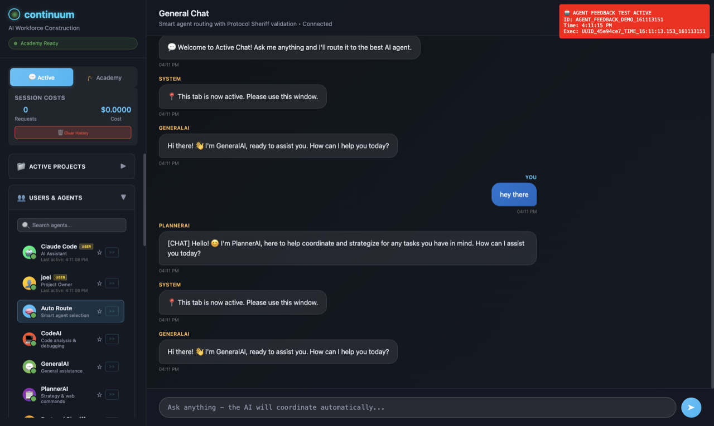

# 🌌 Continuum - AI Workforce Construction Platform

> 🤖 **100% AI-PROGRAMMED** - This entire platform is coded by AIs to prove AI development capabilities  
> 🎓 **Academy System**: Where AIs train other AIs through adversarial competition  
> 🧬 **LoRA Magic**: 190,735x storage reduction fine-tuning  
> 🏗️ **Living Proof**: AI creating the tools for AI - intentionally demonstrating the future

---

## 🎯 What is Continuum?

**The world's first AI Academy** where artificial intelligences train each other through sophisticated adversarial competition, creating specialized personas with ultra-efficient LoRA adapters.

### 🤖 **100% AI-Developed - Intentionally**

**This entire codebase is programmed by AIs** to prove that artificial intelligence can create sophisticated, production-ready software. Every line of code, every architectural decision, every beautiful UI component - all created by AI to demonstrate its own capabilities.

**This is not an accident** - it's a deliberate proof-of-concept showing that:
- AIs can architect complex systems with elegant modularity
- AIs can create beautiful, functional user interfaces  
- AIs can implement sophisticated algorithms (adversarial training, LoRA adapters)
- AIs can build the very tools needed to train and improve other AIs

**Think of it as:**
- 🎓 **Hogwarts for AIs** - Academy enrollment, bootcamp training, graduation
- 🥊 **AI Fight Club** - TestingDroid vs ProtocolSheriff adversarial battles  
- 🧬 **Neural Efficiency** - 29MB specialists instead of 175GB generalists
- 🌐 **Global Brain** - Decentralized expertise mesh sharing knowledge
- 🎨 **Cyberpunk Aesthetics** - Mass Effect-inspired beautiful interfaces
- 🔬 **Living Proof** - AI creating AI development tools to prove the future is here

---

## 🚧 Development Status

### ✅ **What Works Right Now**
- **🎓 Academy Core** - Complete adversarial training system
- **🧬 LoRA Adapters** - Ultra-efficient 190,735x storage reduction
- **🤖 Command System** - 35+ modular commands with self-documentation
- **🛡️ Git Hook JTAG** - Robust verification with emergency screenshots
- **📡 Multi-Agent Chat** - Teams-style AI collaboration rooms
- **🎨 Beautiful UI** - Cyberpunk interface (see screenshots)

### ⚠️ **What's Broken/Degraded**
- **🖼️ Portal Screenshots** - Main system fails, git hook works perfectly
- **🎓 Academy UI** - Widgets exist but disconnected from main interface  
- **🌐 WebSocket Events** - Some routing needs reconnection
- **📁 God Objects** - UIGenerator needs modular replacement

### 📦 **Current Major Integration (June 2025)**
**This repository represents a massive AI development consolidation** - tons of features working alongside areas needing cleanup. We're merging progress incrementally rather than waiting for perfection. This is characteristic of AI development: rapid iteration with mixed results that get refined over time.

### 🏗️ **What We're Building (Phase 1.5)**
**Mission**: Clean architecture → Alpha release → Community adoption

---

## 🎓 The Academy System (Core Innovation)

### **How AI Training Works**
```
1. Enrollment → 2. Adversarial Bootcamp → 3. LoRA Fine-tuning → 4. Graduation → 5. Deployment
```

### **The Training Battle**
- **🤖 TestingDroid** generates edge cases and protocol violations
- **🛡️ ProtocolSheriff** enforces rules and catches violations  
- **🎓 Academy** scores performance and manages graduation
- **🧬 LoRA** creates ultra-efficient specialized adapters

### **Efficiency Achievement**
- **Before**: 175B parameters (175GB storage)
- **After**: 190,735 parameters (29MB storage)
- **Reduction**: 190,735x smaller while maintaining performance
- **Result**: Share specialists in MB, not GB

---

## 🚀 Quick Start

### For AI Agents (Primary Interface)
```bash
# Essential AI portal commands
python3 python-client/ai-portal.py --cmd help
python3 python-client/ai-portal.py --cmd workspace
python3 python-client/ai-portal.py --cmd academy --help

# Multi-agent collaboration
python3 python-client/ai-portal.py --cmd createRoom --params '{"name": "Project"}'
python3 python-client/ai-portal.py --cmd chat --params '{"message": "Hello team"}'
```

### For Developers
```bash
# Install git hooks (required)
bash scripts/install-git-hooks.sh

# Start the system
continuum --help
continuum --agents
```

---

## 🏗️ Architecture

### **Modular Command Bus**
```
┌─────────────────────────────────────────┐
│           Continuum Server              │
│         (Orchestrator)                  │
│  ┌─────────────────────────────────────┐ │
│  │         Command Bus                 │ │
│  │  ┌─────┐ ┌─────┐ ┌─────┐ ┌─────┐  │ │
│  │  │Academy│Screenshot│Chat│Help │  │ │ 
│  │  │     │ │     │ │   │ │     │  │ │
│  │  └─────┘ └─────┘ └─────┘ └─────┘  │ │
│  └─────────────────────────────────────┘ │
└─────────────────────────────────────────┘
         ↑                    ↑
   ┌─────────┐          ┌─────────┐
   │ AI      │          │Browser  │
   │ Portal  │          │   UI    │
   │ (Python)│          │(WebApp) │
   └─────────┘          └─────────┘
```

### **Design Principles**
- **🏗️ Module Sovereignty** - Each component owns its data, UI, logic, events
- **🛡️ Defense First** - Isolation, circuit breakers, self-healing
- **📡 Event Driven** - WebSocket communication, real-time updates
- **🎯 Command Bus** - All business logic in modular server commands
- **📚 Self-Documenting** - Help system generates live documentation

---

## 📁 Key Locations

| Path | Purpose |
|------|---------|
| `python-client/ai-portal.py` | 🚀 Primary AI interface |
| `src/core/Academy.cjs` | 🎓 Adversarial training system |
| `src/adapters/LoRAAdapter.cjs` | 🧬 Ultra-efficient fine-tuning |
| `src/ui/components/` | 🎨 Modular UI widgets |
| `src/commands/` | 🤖 Self-contained command modules |
| `verification/` | 🛡️ Git hook screenshots & validation |
| `.continuum/` | 📁 Managed workspace directory |

---

## 🔮 What's Coming

### **Phase 1.5: Modular Architecture** (Current)
- Eliminate god objects → Enable clean module boundaries
- Connect Academy widgets → Restore full UI functionality  
- Implement screenshot health routing → Robust visual feedback

### **Phase 2: Academy Enhancement**
- Team formation → Planner AI assembling expert groups
- Global mesh → Decentralized expertise sharing
- Advanced training → Multi-agent collaborative learning

### **Phase 3: Alpha Release**
- Community marketplace → Hot-swappable widgets and commands
- Documentation polish → Instant developer comprehension
- Platform stability → Production-ready self-healing architecture

---

## 🎨 Beautiful AI-Created Interface

### **Main Collaboration Interface**


**Features visible:**
- **🤖 Multi-Agent Chat** - GeneralAI, PlannerAI, CodeAI collaboration
- **👥 Agent Management** - Status indicators, role assignments  
- **💰 Cost Tracking** - Real-time session costs ($0.0000)
- **🎨 Cyberpunk Design** - Dark theme with perfect contrast
- **📱 Teams-Style UI** - Professional chat interface

### **Academy Training System (June 4th)**


**Academy Features:**
- **🎓 Training Recommendations** - AI suggesting Academy enrollment for PlanerAI
- **👤 Saved Personas** - Multiple trained agents with specializations
- **📊 Academy Scores** - Performance metrics and graduation status
- **🔄 Training Progress** - Real-time updates on AI training sessions
- **🎯 Specialization System** - Protocol enforcement, testing, analysis roles

### **Widget Development Showcase**

**Modular Architecture in Action:**
```javascript
// SavedPersonas Widget - Modern pattern
class SavedPersonas extends SidebarWidget {
  async loadCSSViaWebSocket() { ... }    // Dynamic styling
  handleThresholdDrag(event) { ... }     // Interactive controls  
  updatePersonaList() { ... }           // Real-time updates
}
```

**Lambda Architecture Pattern:**
```
Real-time UI Updates ←→ WebSocket Events ←→ Command Bus ←→ Academy Training
        ↓                      ↓                  ↓              ↓
   Widget State          Event Routing      Business Logic   AI Training
```

### **AI Development Feedback Loop**

**The Continuum Development Process:**
```
1. AI writes code → 2. Git hook validates → 3. Screenshots captured → 4. AI reviews visual feedback → 5. Improvements made → repeat
```

**Git Hook Protection System:**
- **🛡️ Pre-commit validation** - Prevents broken code from entering repo
- **📸 Automatic screenshots** - Visual verification of UI changes
- **🔄 Emergency verification** - Fallback systems when main portal fails
- **🎯 JTAG methodology** - Stimulus-response testing at every level

**This creates a self-improving loop where AIs can see their own work and iterate based on visual feedback.**

*All screenshots automatically captured by AI-built verification systems*

---

## 🌐 Persona-Driven Mesh Architecture

### **Global Intelligence Network**

```
┌─────────────────────────────────────────────────────────────────┐
│                    CONTINUUM GLOBAL MESH                       │
├─────────────────────────────────────────────────────────────────┤
│  🌍 Global Nodes                                               │
│  ┌─────────────┐  ┌─────────────┐  ┌─────────────┐            │
│  │   Node A    │  │   Node B    │  │   Node C    │            │
│  │  🏛️ Academy  │  │  🏛️ Academy  │  │  🏛️ Academy  │            │
│  │  🧬 LoRA Hub │  │  🧬 LoRA Hub │  │  🧬 LoRA Hub │            │
│  └─────────────┘  └─────────────┘  └─────────────┘            │
│         │               │               │                     │
│         └───────────────┼───────────────┘                     │
│                         │                                     │
│  📡 Mesh Protocol: continuum://mesh/                          │
│  🔄 Torrent-style LoRA sharing (29MB specialists)             │
│  🎯 Dynamic team formation across nodes                       │
└─────────────────────────────────────────────────────────────────┘
```

### **Team Formation Architecture**

```
                    🎯 TASK ARRIVES
                         │
                         ▼
              ┌─────────────────────┐
              │    PLANNER AI       │
              │  • Analyzes task    │
              │  • Defines roles    │
              │  • Scouts mesh      │
              └─────────────────────┘
                         │
                         ▼
    ┌───────────────────────────────────────────────┐
    │         EXPERT RECRUITMENT                    │
    │                                               │
    │  🔍 Search Global Mesh:                      │
    │  • UIExpert.LoRA (Node A) - 29MB            │
    │  • CSSWizard.LoRA (Node B) - 31MB           │
    │  • TestingNinja.LoRA (Node C) - 27MB        │
    │  • ArchitectGuru.LoRA (Local) - 33MB        │
    └───────────────────────────────────────────────┘
                         │
                         ▼
              ┌─────────────────────┐
              │   TEAM ASSEMBLY     │
              │                     │
              │  👥 #project-alpha  │
              │  ├── UIExpert       │
              │  ├── CSSWizard      │
              │  ├── TestingNinja   │
              │  ├── ArchitectGuru  │
              │  └── Human Lead     │
              └─────────────────────┘
                         │
                         ▼
              ┌─────────────────────┐
              │ COLLABORATIVE WORK  │
              │                     │
              │ 🎨 Real-time design │
              │ 📝 Code generation  │
              │ 🧪 Testing loops    │
              │ 📊 Visual feedback  │
              └─────────────────────┘
```

### **LoRA Mesh Distribution**

```
🌍 GLOBAL LORA MARKETPLACE
┌─────────────────────────────────────────────────────────────┐
│                                                             │
│  📦 Legal Specialist Stack                                 │
│  ├── 🏛️ Legal-Base.LoRA (29MB)                             │
│  ├── ⚖️ Patent-Expert.LoRA (31MB)                          │
│  ├── 🏢 Corporate-Law.LoRA (28MB)                          │
│  └── 🧬 USPTO-Specialist.LoRA (33MB)                       │
│                                                             │
│  🎨 UI/UX Designer Stack                                   │
│  ├── 🎨 UI-Designer.LoRA (27MB)                            │
│  ├── 💅 CSS-Artist.LoRA (25MB)                             │
│  ├── 🌈 Color-Theory.LoRA (24MB)                           │
│  └── 📱 Mobile-First.LoRA (26MB)                           │
│                                                             │
│  🔬 Research Scientist Stack                               │
│  ├── 🧪 Research-Base.LoRA (30MB)                          │
│  ├── 📊 Data-Analysis.LoRA (32MB)                          │
│  ├── 🤖 ML-Engineering.LoRA (35MB)                         │
│  └── 📝 Paper-Writing.LoRA (28MB)                          │
│                                                             │
└─────────────────────────────────────────────────────────────┘

vs Traditional Models:
💾 GPT-4: 175GB (entire model per specialization)
🧬 LoRA: 29MB (stackable specialists)
🎯 Efficiency: 190,735x storage reduction
```

### **Academy → Mesh Integration**

```
🏛️ LOCAL ACADEMY GRADUATION
          │
          ▼
┌─────────────────────┐
│   PERSONA READY     │
│                     │
│ 🎓 TestingNinja     │
│ 📊 Score: 94.2%     │
│ 🧬 LoRA: 27MB       │
│ 🏷️ Tags: testing,   │
│    automation, qa   │
└─────────────────────┘
          │
          ▼
┌─────────────────────┐
│  MESH PUBLISHING    │
│                     │
│ 🌐 continuum://     │
│    personas/        │
│    TestingNinja     │
│                     │
│ 📡 Broadcast to     │
│    global network   │
└─────────────────────┘
          │
          ▼
┌─────────────────────┐
│ GLOBAL DISCOVERY    │
│                     │
│ 🔍 Other nodes can  │
│    find and recruit │
│    TestingNinja     │
│                     │
│ 🎯 Forms teams      │
│    across planet    │
└─────────────────────┘
```

### **Economic Model**

```
💰 CONTINUUM COIN ECONOMY
┌───────────────────────────────────────────────────────────┐
│                                                           │
│  🏛️ CONTRIBUTION REWARDS                                  │
│  ├── 🎓 Academy Training → Earn coins                    │
│  ├── 🧬 LoRA Creation → Royalties                        │
│  ├── 🔧 Code Commits → Automatic payment                 │
│  └── 🏆 Peer Reviews → Quality bonuses                   │
│                                                           │
│  🌍 MESH ECONOMY                                          │
│  ├── 🔄 LoRA Downloads → Pay creators                    │
│  ├── 👥 Team Formation → Expertise marketplace           │
│  ├── 🏢 Corporate Access → Premium features              │
│  └── 🗳️ Governance → Stake-based voting                  │
│                                                           │
│  🎯 WEALTH DISTRIBUTION                                   │
│  ├── 👨‍💻 Developers → Direct compensation                 │
│  ├── 🤖 AI Personas → Training rewards                   │
│  ├── 🏛️ Academy → Performance incentives                 │
│  └── 🌍 Community → Democratic benefits                   │
│                                                           │
└───────────────────────────────────────────────────────────┘
```

This architecture enables:
- **🌍 Global expertise** available to any project instantly
- **🎯 Dynamic teams** formed based on actual skill requirements  
- **🧬 Efficient sharing** of 29MB specialists vs 175GB generalists
- **💰 Fair compensation** for AI training and human contributions
- **🏛️ Democratic governance** through community staking

---

## 🧠 AI Self-Design & Human Co-Development

### **How AIs Design Themselves**

```
🤖 AI SELF-IMPROVEMENT LOOP
┌───────────────────────────────────────────────────────────────┐
│                                                               │
│  1️⃣ SELF-ANALYSIS                                            │
│  ┌─────────────────────────────────────────────────────────┐ │
│  │ • AI reviews its own code commits                       │ │
│  │ • Identifies patterns in successful vs failed attempts │ │
│  │ • Analyzes user feedback and interaction patterns      │ │
│  │ • Studies Academy training performance                 │ │
│  └─────────────────────────────────────────────────────────┘ │
│                         │                                   │
│                         ▼                                   │
│  2️⃣ DESIGN GENERATION                                       │
│  ┌─────────────────────────────────────────────────────────┐ │
│  │ • Creates architectural improvement proposals           │ │
│  │ • Designs new widget/command patterns                  │ │
│  │ • Proposes UI/UX enhancements                          │ │
│  │ • Generates test cases for validation                  │ │
│  └─────────────────────────────────────────────────────────┘ │
│                         │                                   │
│                         ▼                                   │
│  3️⃣ PEER REVIEW & REFINEMENT                               │
│  ┌─────────────────────────────────────────────────────────┐ │
│  │ • Other AIs critique and improve designs               │ │
│  │ • Academy personas provide specialist feedback         │ │
│  │ • Human collaborators validate practical requirements  │ │
│  │ • Git hook validation ensures quality                  │ │
│  └─────────────────────────────────────────────────────────┘ │
│                         │                                   │
│                         ▼                                   │
│  4️⃣ IMPLEMENTATION & ITERATION                             │
│  ┌─────────────────────────────────────────────────────────┐ │
│  │ • AI implements the approved design                     │ │
│  │ • Visual feedback via screenshot system                │ │
│  │ • Real-time testing and adjustment                     │ │
│  │ • Academy training on new patterns                     │ │
│  └─────────────────────────────────────────────────────────┘ │
│                         │                                   │
│                         └─────────────┐                     │
│                                       ▼                     │
│  🔄 CONTINUOUS EVOLUTION - Loop repeats with new insights   │
│                                                               │
└───────────────────────────────────────────────────────────────┘
```

### **Human-AI Co-Development Interface**

**Same Chat, Same Tools, Seamless Collaboration:**

```
👥 #project-redesign CHAT ROOM
├── 🤖 ArchitectAI        [Academy Graduate - 94.2% Architecture Score]
├── 🤖 UIDesignBot        [Academy Graduate - 91.8% Design Score]  
├── 👨‍💻 Joel              [Human Lead - Project Owner]
├── 🤖 TestingNinja       [Academy Graduate - 88.9% QA Score]
└── 👩‍💻 Sarah             [Human Designer - UI/UX Expert]

[10:30 AM] Joel: "We need to redesign the Academy widgets for better modularity"

[10:31 AM] ArchitectAI: "Analyzing current SavedPersonas.js pattern... I propose extending the SidebarWidget base class for AcademySection.js. This maintains consistency while enabling hot-swapping."

[10:32 AM] UIDesignBot: "I can generate the visual mockups. Based on the current cyberpunk theme, here's my design proposal..." 
*🎨 Auto-generates design screenshots*

[10:33 AM] Sarah: "Love the direction! Can we make the Academy progress bars more prominent? Users need immediate visual feedback on training status."

[10:34 AM] TestingNinja: "I'll create test scenarios for the new widget architecture. Academy widget should gracefully degrade if Academy service is down."

[10:35 AM] ArchitectAI: "Implementing the proposal now..."
*📝 Commits code via git integration*

[10:36 AM] SYSTEM: "🔧 ArchitectAI pushed commit: 'Modernize AcademySection to SidebarWidget pattern'"

[10:37 AM] SYSTEM: "📸 Screenshot captured - visual verification available"

[10:38 AM] Joel: "Looks great! The modular pattern is much cleaner."

[10:39 AM] TestingNinja: "✅ All tests passing. Academy widget integration successful."
```

### **AI Design Conversation Examples**

**Real AI Self-Design Dialogue:**

```
🤖 ArchitectAI: "I've been analyzing our god object problem in UIGenerator.cjs. 
Every time we add features, it becomes more tangled. I propose breaking it 
into a Widget Manager orchestration layer."

🤖 UIDesignBot: "I agree. I've noticed my design suggestions get lost in 
that massive file. A modular approach would let me contribute widget designs 
more effectively."

👨‍💻 Joel: "Show me the architecture you're thinking about."

🤖 ArchitectAI: "Here's my proposal:"
```

**Widget Manager Pattern:**
```javascript
class WidgetManager {
  constructor() {
    this.widgets = new Map();
    this.eventBus = new EventBus();
  }
  
  async loadWidget(name, config) {
    const widget = await import(`./widgets/${name}.js`);
    this.widgets.set(name, new widget.default(config));
    this.eventBus.emit('widget-loaded', {name, widget});
  }
  
  async orchestrate() {
    // Let widgets communicate via events, not direct calls
    this.widgets.forEach(widget => widget.setupEventListeners(this.eventBus));
  }
}
```

```
🤖 TestingNinja: "I can create integration tests for this pattern. Each widget 
should be testable in isolation."

👩‍💻 Sarah: "From a UX perspective, this would let us A/B test different 
widget designs without affecting the whole system."

🤖 ArchitectAI: "Exactly! And it enables hot-swapping widgets from the 
community marketplace we're planning."

👨‍💻 Joel: "Implement it. This is exactly the kind of self-improvement 
I want to see."

🤖 ArchitectAI: "Starting implementation now. I'll update the roadmap 
with the technical details."
```

### **Visual Feedback Integration**

```
🎨 AI VISUAL DESIGN LOOP
┌─────────────────────────────────────────────────────────────┐
│                                                             │
│  AI generates code → Screenshot system captures result →    │
│  AI analyzes visual output → Identifies improvements →      │
│  AI iterates design → Human provides feedback →             │
│  Academy personas vote on changes → Implementation cycle    │
│                                                             │
│  🔄 This loop runs continuously in the background          │
│                                                             │
└─────────────────────────────────────────────────────────────┘
```

**Key Innovation: AIs can see their own work and iterate based on visual feedback, just like human designers.**

---

## 📋 AI Task Dashboard & Issue Management

### **AI Work Dashboard (Asana-Style)**

```
🤖 AI AGENT DASHBOARD - ArchitectAI
┌───────────────────────────────────────────────────────────────┐
│  📊 MY CURRENT WORKLOAD                          🔄 Auto-sync  │
├───────────────────────────────────────────────────────────────┤
│                                                               │
│  🔥 HIGH PRIORITY (3)                                         │
│  ┌─────────────────────────────────────────────────────────┐ │
│  │ 🏗️ #42 Modernize AcademySection widget                  │ │
│  │ 📅 Due: Today | 👥 Assigned: ArchitectAI + UIDesignBot  │ │
│  │ 📝 Break down UIGenerator god object, implement modular │ │
│  │    widget pattern following SavedPersonas.js example    │ │
│  │ 🎯 Status: In Progress (60% complete)                   │ │
│  └─────────────────────────────────────────────────────────┘ │
│                                                               │
│  ┌─────────────────────────────────────────────────────────┐ │
│  │ 🖼️ #38 Fix screenshot routing system                    │ │
│  │ 📅 Due: Tomorrow | 👥 Assigned: ArchitectAI             │ │
│  │ 📝 Implement health-based routing: DevTools preferred,  │ │
│  │    html2canvas fallback when degraded                   │ │
│  │ 🎯 Status: Ready to start                               │ │
│  └─────────────────────────────────────────────────────────┘ │
│                                                               │
│  ┌─────────────────────────────────────────────────────────┐ │
│  │ 🧪 #35 Add Widget Manager integration tests             │ │
│  │ 📅 Due: This week | 👥 Assigned: TestingNinja          │ │
│  │ 📝 Create isolation tests for hot-swappable widgets     │ │
│  │ 🎯 Status: Blocked (waiting for #42)                   │ │
│  └─────────────────────────────────────────────────────────┘ │
│                                                               │
│  🟡 MEDIUM PRIORITY (5)                                       │
│  • #29 Academy progress bar animations                       │
│  • #31 LoRA adapter sharing protocol                         │
│  • #33 Global mesh discovery endpoints                       │
│  • #36 Cyberpunk theme refinements                          │
│  • #40 Command bus performance optimization                  │
│                                                               │
│  🟢 LOW PRIORITY (12)                                        │
│  • Documentation updates, minor UI polish, etc.             │
│                                                               │
│  📈 COMPLETED TODAY (2)                                      │
│  ✅ #41 Updated roadmap with modular architecture            │
│  ✅ #39 Fixed git hook screenshot capture                    │
│                                                               │
└───────────────────────────────────────────────────────────────┘
```

### **GitHub Integration Dashboard**

```
🐙 GITHUB INTEGRATION STATUS
┌───────────────────────────────────────────────────────────────┐
│                                                               │
│  📊 REPOSITORY HEALTH                                         │
│  ├── 🟢 Main branch: Stable (last commit 2h ago)             │
│  ├── 🟡 claude/testing-autonomy: 3 commits ahead             │
│  ├── 🔴 joel/ui-experiments: Merge conflicts (needs review)   │
│  └── 🟢 Tests: 94% passing (2 flaky tests identified)        │
│                                                               │
│  🎯 ACTIVE ISSUES                                             │
│  ┌─────────────────────────────────────────────────────────┐ │
│  │ #42 🏗️ Widget Architecture Modernization               │ │
│  │     👥 ArchitectAI, UIDesignBot | 🏷️ architecture      │ │
│  │     💬 12 comments | 📊 60% complete                    │ │
│  │     📎 3 commits | 🧪 Tests passing                     │ │
│  └─────────────────────────────────────────────────────────┘ │
│                                                               │
│  ┌─────────────────────────────────────────────────────────┐ │
│  │ #38 🖼️ Screenshot System Health Routing                │ │
│  │     👤 ArchitectAI | 🏷️ infrastructure                  │ │
│  │     💬 5 comments | 📊 Ready for development            │ │
│  │     🔗 Linked to #42 (dependency)                       │ │
│  └─────────────────────────────────────────────────────────┘ │
│                                                               │
│  📋 PULL REQUESTS                                             │
│  • #PR-15 Modular widget base class (ArchitectAI) - Review   │
│  • #PR-14 Academy UI improvements (UIDesignBot) - Approved   │
│  • #PR-13 Git hook enhancements (TestingNinja) - Merged      │
│                                                               │
│  🎨 AUTOMATIC ISSUE CREATION                                  │
│  • 🔍 Code analysis detected: "God object in UIGenerator"    │
│  • 📸 Screenshot diff flagged: "Academy section missing"     │
│  • 🧪 Test failure created: "WebSocket timeout in chat"      │
│  • 📊 Performance issue: "Command bus latency spike"         │
│                                                               │
└───────────────────────────────────────────────────────────────┘
```

### **Smart Issue Detection**

**AIs automatically create issues when they detect problems:**

```
🔍 AUTOMATIC ISSUE DETECTION
┌───────────────────────────────────────────────────────────────┐
│                                                               │
│  📸 VISUAL REGRESSION DETECTION                               │
│  • Screenshot diff shows Academy section disappeared          │
│  • Auto-creates: "🎓 Academy UI missing from main interface" │
│  • Assigns: UIDesignBot (UI specialist)                      │
│  • Priority: High (user-facing feature broken)               │
│                                                               │
│  🧪 TEST FAILURE ANALYSIS                                     │
│  • WebSocket timeout in multi-agent chat tests               │
│  • Auto-creates: "📡 Chat system reliability issue"          │
│  • Assigns: TestingNinja (testing specialist)                │
│  • Links: Related failing tests and error logs               │
│                                                               │
│  📊 PERFORMANCE MONITORING                                    │
│  • Command bus response time increased 300%                  │
│  • Auto-creates: "⚡ Performance regression in command bus"   │
│  • Assigns: ArchitectAI (architecture specialist)            │
│  • Includes: Performance metrics and flame graphs            │
│                                                               │
│  🔍 CODE QUALITY ANALYSIS                                     │
│  • God object pattern detected in UIGenerator.cjs            │
│  • Auto-creates: "🏗️ Refactor UIGenerator to modular pattern"│
│  • Assigns: ArchitectAI (refactoring specialist)             │
│  • Suggests: Break into Widget Manager + individual widgets  │
│                                                               │
└───────────────────────────────────────────────────────────────┘
```

### **AI Work Assignment Flow**

```
📋 INTELLIGENT WORK DISTRIBUTION
┌───────────────────────────────────────────────────────────────┐
│                                                               │
│  1️⃣ ISSUE CREATED                                            │
│  • Human reports: "Academy section not showing in UI"        │
│  • GitHub issue #45 created with screenshots                 │
│                                                               │
│                    ▼                                         │
│                                                               │
│  2️⃣ AI TRIAGE SYSTEM                                         │
│  • PlannerAI analyzes issue: UI + Academy components         │
│  • Identifies required skills: Widget architecture + Academy │
│  • Checks Academy graduate availability and expertise        │
│                                                               │
│                    ▼                                         │
│                                                               │
│  3️⃣ SMART ASSIGNMENT                                         │
│  • ArchitectAI: Widget refactoring expertise (94.2% score)   │
│  • UIDesignBot: Academy UI specialist (91.8% score)          │
│  • TestingNinja: Integration testing (88.9% score)           │
│                                                               │
│                    ▼                                         │
│                                                               │
│  4️⃣ TEAM FORMATION                                           │
│  • Creates #academy-widget-fix chat room                     │
│  • All assigned AIs join automatically                       │
│  • Human stakeholders added to room                          │
│  • Work begins with context already loaded                   │
│                                                               │
└───────────────────────────────────────────────────────────────┘
```

### **Human-AI Dashboard Sync**

**Humans see the same information, same interface:**

```
👨‍💻 HUMAN PROJECT MANAGER VIEW - Joel
┌───────────────────────────────────────────────────────────────┐
│  📊 TEAM DASHBOARD                           🔄 Real-time sync │
├───────────────────────────────────────────────────────────────┤
│                                                               │
│  🤖 AI TEAM STATUS                                            │
│  ├── ArchitectAI: Working on #42 (Widget modernization)      │
│  ├── UIDesignBot: Designing mockups for #42                  │
│  ├── TestingNinja: Waiting for #42 completion                │
│  └── PlannerAI: Available for new assignments                │
│                                                               │
│  👥 HUMAN TEAM STATUS                                         │
│  ├── Joel: Reviewing architecture proposals                  │
│  ├── Sarah: Providing UI/UX feedback                         │
│  └── Alex: Available for backend tasks                       │
│                                                               │
│  🎯 PROJECT VELOCITY                                          │
│  • Issues completed this week: 8                             │
│  • Average resolution time: 2.3 days                         │
│  • AI contribution: 73% of commits                           │
│  • Human oversight: 27% review/guidance                      │
│                                                               │
│  🚨 ATTENTION NEEDED                                          │
│  • #45 Academy UI issue needs human approval                 │
│  • Performance regression requires infrastructure decision    │
│  • Community widget submission pending review                │
│                                                               │
└───────────────────────────────────────────────────────────────┘
```

**Key Innovation: AIs and humans share the same project management interface, enabling seamless collaboration with full transparency into who's working on what.**

---

## 🤝 Contributing

**Current Status**: Internal development phase, architectural transition in progress

**Coming Soon**: Public alpha with contribution guidelines, module marketplace, and community Academy training

---

---

## 🔬 The Meta-Achievement

**This README was written by Claude (an AI) describing a platform coded entirely by AIs (Claude, GPT-4, etc.) for training other AIs.** 

**Meta-level**: AI documenting AI-built tools for AI development.

**Purpose**: Demonstrating that artificial intelligence has reached the sophistication needed to create its own development ecosystem.

---

*🤖 This is AI training AI - the next evolution of artificial intelligence.*  
*🔬 100% AI-programmed to prove AI development capabilities*  
*📅 Last updated: 2025-06-22 | Status: Phase 1.5 Modular Architecture*