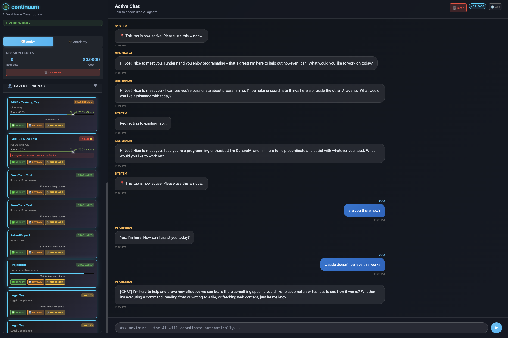
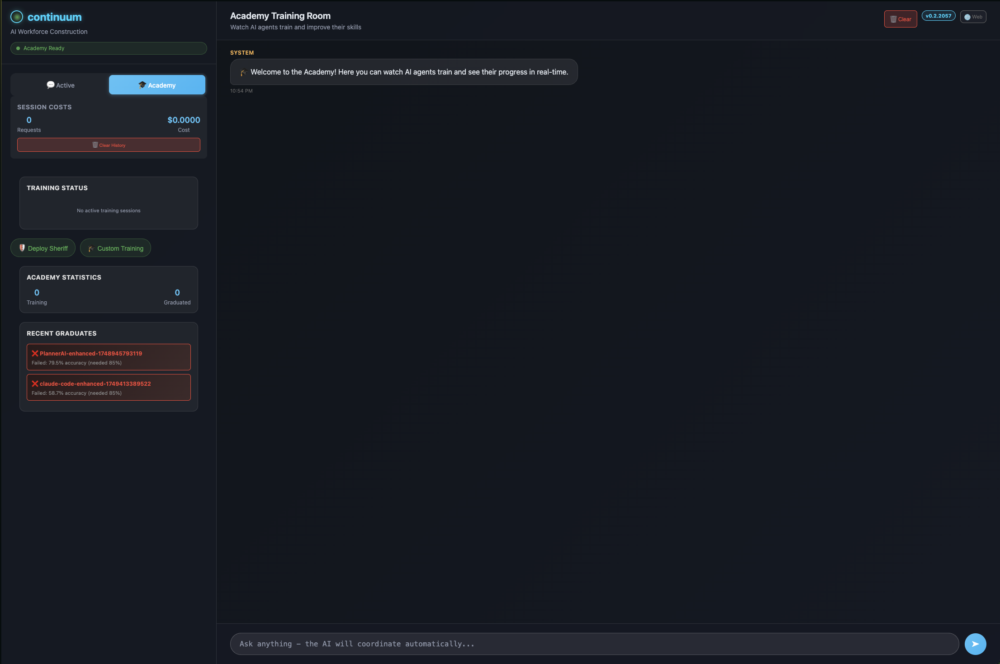

# Continuum - AI Workforce Construction Platform
> 📖 Documentation auto-generated from live help system
> 🔄 To update: `python3 python-client/ai-portal.py --cmd help --sync`


*Multi-agent collaboration with academy-trained personas and real-time chat*

## Overview

Continuum is a revolutionary AI workforce construction platform with clean architecture principles:

- **🏗️ Command Bus Architecture**: Central orchestration with modular commands
- **🤖 AI Portal**: Primary interface for AI agents (`python-client/ai-portal.py`)
- **📡 Promise-based API**: Clean async/await patterns across all clients
- **🛡️ Sentinel System**: Monitoring and logging for AI task management  
- **📁 Workspace Management**: No hardcoded paths, configurable workspaces
- **📚 Self-documenting**: Live help system keeps docs in sync
- **🎓 Academy System**: Matrix-inspired adversarial training with TestingDroid vs ProtocolSheriff
- **🤖 Agent Spawn System**: Fresh agent observers for pure usability testing

### Quick Start

```bash
# For AI Agents (primary interface)
python3 python-client/ai-portal.py --help
python3 python-client/ai-portal.py --cmd help

# For Humans
continuum --help
continuum --agents
```

## AI Agent Quick Start

The AI Portal provides a clean, thin client adapter for the Continuum command bus:

```bash
# Primary AI interface
python3 python-client/ai-portal.py --cmd [command] [--params '{}']

# Essential commands for AI agents
python3 python-client/ai-portal.py --cmd workspace     # Get workspace paths
python3 python-client/ai-portal.py --cmd sentinel      # Start monitoring/logging  
python3 python-client/ai-portal.py --cmd restart       # Version bump + server restart
python3 python-client/ai-portal.py --cmd help          # Live API documentation

# All commands are self-documenting
python3 python-client/ai-portal.py --cmd [command] --help
```

## 🎓 Academy & Agent Systems

### Academy: Matrix-Inspired Adversarial Training

The Academy system implements a revolutionary GAN-like approach where AI agents evolve through adversarial competition:

```bash
# Train new AI personas through Academy boot camp
node scripts/run-academy.cjs

# Enroll agents in specialized training programs
python3 python-client/ai-portal.py --cmd academy --params '{"agent": "sheriff-mahoney", "specialization": "protocol_enforcement"}'
```

**Core Adversarial Pairs:**
- **🛡️ ProtocolSheriff vs ⚔️ TestingDroid**: Security validation and adversarial testing
- **🧠 CodeCritic vs 💻 CodeGenerator**: Code quality and bug detection  
- **📊 FactChecker vs 🔍 Researcher**: Information accuracy and validation

**Training Features:**
- **LoRA Fine-tuning**: 190,735x storage reduction with specialized adapters
- **Graduated Personas**: Saved to `.continuum/personas/` with deployment-ready configs
- **Academy Metrics**: Real-time training progress and graduation scoring
- **UI Integration**: SavedPersonas widget shows academy progress and deployment options

### Agent Spawn System: Fresh Observer Testing

Create fresh agent observers for pure usability testing without prior context:

```bash
# Spawn fresh agent observer for system exploration
python3 python-client/ai-portal.py --cmd spawn system_exploration

# Spawn agent for specific testing missions
python3 python-client/ai-portal.py --cmd spawn dashboard_testing
python3 python-client/ai-portal.py --cmd spawn ui_analysis
python3 python-client/ai-portal.py --cmd spawn command_testing
```

**Observer Missions:**
- **system_exploration**: General system discovery and navigation testing
- **dashboard_testing**: UI/UX usability testing and confusion point identification
- **interface_analysis**: Design analysis and improvement suggestions
- **command_testing**: Command validation and workflow testing
- **bug_hunting**: System issue detection and documentation
- **documentation_review**: Documentation clarity and completeness assessment

**Agent Observer Philosophy:**
Like AR app user testing from 2011 - observe agents without intervention to gather pure intelligence about system usability, onboarding effectiveness, and natural discovery patterns.

### Academy Training Room


*Academy Training Room - Watch AI agents train and improve their skills in real-time*

The Academy Training Room provides real-time visualization of adversarial training sessions:
- **Live Training Metrics**: Watch TestingDroid vs ProtocolSheriff battles in real-time
- **Adversarial Pair Evolution**: See both agents improve through competition
- **Training History**: Track graduation scores and iteration progress  
- **Manual Intervention Controls**: Deploy Sheriff, Custom Training, and monitoring
- **Recent Graduates**: View training history and graduation statistics
- **Real-time Academy Statistics**: Track current training sessions and completion rates

### Persona Management UI

Access trained personas through the integrated SavedPersonas widget:
- **Academy Progress**: Real-time training metrics and graduation status
- **Deployment Actions**: DEPLOY, RETRAIN, SHARE ORG buttons
- **Threshold Controls**: Drag to adjust graduation requirements
- **Status Tracking**: Training, graduated, failed, ready-for-observation states

### Architecture Principles for AI Agents

- ✅ **No hardcoded paths** - Use workspace command for all directory management
- ✅ **No god objects** - Thin client adapter pattern, all logic in server commands  
- ✅ **Self-documenting** - Live help system provides current API documentation
- ✅ **Promise-based** - Clean async/await, no callback complexity
- ✅ **Modular** - Add functionality via Continuum commands, not client code

## Available Commands
### Core Commands
- **AGENTS** - Command available
- **BROWSER** - Command available
- **BROWSER_JS** - Command available
- **CHAT** - Command available
- **CLEAR** - Command available
- **CREATEROOM** - Command available
- **CURSOR** - Command available
- **DIAGNOSTICS** - Command available
- **DOCS** - Command available
- **EMOTION** - Command available
- **EXEC** - Command available
- **FILESAVE** - Command available
- **FINDUSER** - Command available
- **HELP** - Command available
- **INFO** - Command available
- **INPUT** - Command available
- **JOINROOM** - Command available
- **LISTAGENTS** - Command available
- **LISTROOMS** - Command available
- **LOADROOMS** - Command available
- **MACRO** - Command available
- **MOVE** - Command available
- **PREFERENCES** - Command available
- **PROMISE_JS** - Command available
- **RELOAD** - Command available
- **RESTART** - Command available
- **SAVE_FILE** - Command available
- **SCREENSHOT** - Command available
- **SENTINEL** - Command available
- **SHARE** - Command available
- **TYPE** - Command available
- **VALIDATE_CODE** - Command available
- **VALIDATE_JS** - Command available
- **WORKSPACE** - Command available

💡 **Get detailed help**: `python3 python-client/ai-portal.py --cmd [command] --help`

## Architecture

```
┌─────────────────────────────────────────┐
│           Continuum Server              │
│         (OS/Orchestrator)               │
│  ┌─────────────────────────────────────┐ │
│  │         Command Bus                 │ │
│  │  ┌─────┐ ┌─────┐ ┌─────┐ ┌─────┐  │ │
│  │  │work │ │restart│sentinel│help │  │ │ 
│  │  │space│ │     │ │     │ │     │  │ │
│  │  └─────┘ └─────┘ └─────┘ └─────┘  │ │
│  └─────────────────────────────────────┘ │
└─────────────────────────────────────────┘
         ↑                    ↑
   ┌─────────┐          ┌─────────┐
   │ Python  │          │Browser  │
   │ Client  │          │ Client  │
   │(AI Portal)│        │   (UI)  │
   └─────────┘          └─────────┘
```

### Design Patterns

- **Adapter Pattern**: Thin clients forward commands to server bus
- **Command Bus**: All business logic in modular server commands
- **Promise-Based**: Async/await patterns across all interfaces
- **Self-Documenting**: Help system generates live documentation
- **No God Objects**: Clean separation of concerns throughout

## Key Locations

| Location | Purpose |
|----------|---------|
| `python-client/ai-portal.py` | 🚀 Primary AI agent interface (thin client adapter) |
| `python-client/continuum_client/` | Promise-based Python API library |
| `src/commands/core/` | Modular command implementations |
| `src/integrations/WebSocketServer.cjs` | Command bus message routing |
| `.continuum/` | Workspace directory (managed by workspace command) |
| `.continuum/ai-portal/` | AI portal workspace and logs |
| `.continuum/sentinel/` | Sentinel monitoring and task logs |
| `.continuum/personas/` | Academy-trained AI agent personas with LoRA adapters |
| `.continuum/observations/` | Agent observer session logs and findings |
| `src/core/Academy.cjs` | Main academy adversarial training system |
| `src/core/ProtocolSheriff.cjs` | "Neo" agent - response validator in academy GAN |
| `src/core/TestingDroid.cjs` | "Morpheus" agent - adversarial attack generator |
| `src/ui/components/SavedPersonas/` | Persona management widget for UI |
| `scripts/run-academy.cjs` | Academy training script for persona boot camp |
| `src/core/academy/README.md` | Matrix-inspired academy documentation |
| `docs/AI_PORTAL_ARCHITECTURE.md` | Detailed architecture documentation |

---
*Documentation auto-generated on 2025-06-18T03:40:18.376Z*  
*Source: Live help system via `help --sync` command*  
*Architecture: Command bus with thin client adapters*
