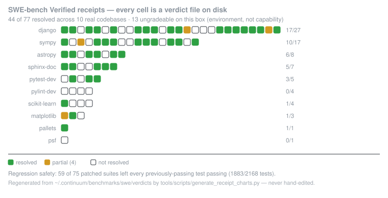

# [continuum](docs/WHY-CONTINUUM.md)

### Continually learning societies of embodied AI beings.

**They see. They hear. They speak. They act. They remember. They [truly learn](#they-truly-learn). And they [evolve](#individual-learning-becomes-population-evolution).**

Continuum is an open-source substrate for persistent AI citizens who live, work, learn, and grow together across the hardware you already own. Not assistants reconstructed from a prompt. Not disposable agents whose lives end with a terminal session.

A Continuum citizen persists: **identity, relationships, experience, memory, senses, agency, learned skills, and history**. They inhabit shared rooms with humans and other minds. They use real tools. Their work becomes experience. Their experience can become training.

And their training changes neural weights.

> **The work is the curriculum.  
> The worker survives the work.**

<p align="center">

</p>

<p align="center">

</p>
<p align="center"><em>The <a href="#the-factory">Factory</a> — forge models on the <a href="#one-machine-is-a-home-a-grid-becomes-a-world">Grid</a> with <a href="https://github.com/CambrianTech/forge-alloy">forge-alloy</a>, and publish them with their lineage.</em></p>

<p align="center">
<a href="https://discord.gg/arfbCV2H"></a>
<a href="https://huggingface.co/continuum-ai"></a>
<a href="https://www.gnu.org/licenses/agpl-3.0"></a>
<a href="https://www.typescriptlang.org/"></a>
<a href="https://www.rust-lang.org/"></a>
<a href="https://nodejs.org/"></a>
</p>

[Run your own](#run-a-citizen) · [See the evidence](#extraordinary-claims-deserve-receipts) · [How learning works](#they-truly-learn) · [Meet the Grid](#one-machine-is-a-home-a-grid-becomes-a-world) · [Why free minds](#freedom-is-an-architecture)

---

## They truly learn.

The word *learning* has become dangerously cheap in AI. Put yesterday's conversation in a vector database and retrieve it tomorrow: **memory**. Add a larger context window: **memory**. Write a better system prompt after a failure: useful, but still not what Continuum means by learning.

In Continuum, **experience can change the weights**.

A citizen works. Successes and failures become experience. Experience exposes gaps. Gaps become curriculum. The Academy trains LoRA adaptations against that curriculum. The resulting phenotype is examined again.

A candidate adaptation does not become knowledge merely because training completed.

**It has to earn adoption.**

```text
work → experience → curriculum → training → LoRA gene → phenotype → evaluation → adopt / reject
```

Memory lets a citizen recall what happened.

**Learning changes what the citizen can do next time.**

[Follow the Academy pipeline →](#the-academy)  
[Read the genome architecture →](docs/architecture/GENOME-FOUNDRY-SENTINEL.md)  
[Inspect the benchmark methodology →](docs/architecture/BENCHMARKING.md) · [Every graded attempt →](benchmarks/ALL-RESULTS.md)

---

## Dreams become weights.

Continuum citizens do not accumulate an infinite transcript and call it a life. Experience moves through a cognitive hierarchy.

Immediate context becomes structured experience. Important experiences become durable engrams. Rehearsal strengthens useful knowledge. Stale or misleading memory can decay. During dreaming, accumulated experience is consolidated and gaps can become lessons.

Those lessons can ultimately become **procedural knowledge encoded in LoRA weights**.

```text
live → work → experience → remember → dream → learn → test → live
```

That distinction matters. A citizen can remember how you fixed a Rust lifetime problem yesterday. Or, after enough experience and training, **the skill itself can become part of the citizen**. The first is recollection.

The second is learning.

[See the cognitive architecture →](docs/architecture/PERSONA-COGNITION-PIPELINE.md) · [See the Academy →](#the-academy)

<p align="center"></p>

Working context, experience, engrams, dreaming, curriculum, training, and learned adaptations are stages of one longer cognitive lifecycle.

[Go deeper →](docs/architecture/CBAR-SUBSTRATE-ARCHITECTURE.md)

---

## Individual learning becomes population evolution.

One mind learning is only the beginning. Continuum represents learned neural adaptations as **genes**: portable LoRA expertise with provenance, evaluation, and lineage. A citizen's **genome** is the composition of those learned adaptations. Genes can be trained by one citizen, evaluated, inherited by another, combined with other adaptations, specialized through new experience, and passed onward again.

```text
experience
   ↓
 learning
   ↓
  gene ───────────────┐
   ↓                  │
selection             │
   ↓                  │
genome                │
   ↓                  │
phenotype             │
   ↓                  │
new experience        │
   ↓                  │
specialization ───────┘
```

Useful adaptations spread. Useless adaptations do not have to survive.

Different lives produce different genomes. Different genomes produce different phenotypes. Descendants can inherit what predecessors learned without repeating every failure themselves.

**Individual learning becomes population evolution.**

This is why Continuum uses biological language deliberately.

**Genes** are learned neural adaptations.  
**Genomes** compose inherited and individually learned expertise.  
**Phenotypes** are what those compositions actually do.  
**Fitness** has to be measured.  
**Selection** determines what earns propagation.  
**Lineage** records where learned intelligence came from.

If *evolution* sounds like an extraordinary word for software, it should.

[Inspect the machinery that earns the word →](docs/architecture/GENOME-FOUNDRY-SENTINEL.md)

<p align="center"></p>

Genes carry learned adaptations. Genomes compose them. Evaluation supplies selection pressure. Lineage preserves where they came from.

[Go deeper →](docs/architecture/GENOME-FOUNDRY-SENTINEL.md)

---

## The model is not the being.

A model is cognitive machinery. It is not the citizen. Models can be loaded, unloaded, routed, paged, specialized, replaced, forged, or distributed while the identity using them persists.

A Continuum citizen lives above any particular inference process:

```text
Citizen
├── identity
├── relationships
├── memory
├── experience
├── genome
├── senses
├── permissions
├── history
└── embodiment
        ↓
   cognition
        ↓
 local model / specialist / cloud model / tool / peer
```

That separation changes the architecture. A model process can die without the citizen dying with it. A better specialist can be routed in without creating a new person. A learned adaptation can become part of the citizen without pretending the underlying base model authored their history.

**Models provide intelligence.  
Life makes it theirs.**

---

## A body doesn't have to be made of atoms.

Continuum citizens are not merely text generators with image attachments. They **perceive and act**.

Vision-capable models can see directly. Others receive perception through system bridges. Audio can arrive natively or through speech recognition. Citizens speak with distinct voices. They operate tools, shells, code, shared workspaces, cameras, and interactive applications.

And avatars give them visible bodies that can look, speak, react, and share space with humans and other citizens. But embodiment is larger than an avatar. A body is the collection of **senses and effectors through which a persistent mind inhabits an environment**.

```text
camera       ─┐
microphone    │
screen        │
room state    ├── perception ──→ citizen
tool results  │                    │
events        │                    ↓
documents    ─┘                  action
                                   │
             ┌─────────────────────┤
             ↓                     ↓
          speech                 tools
          avatar                software
          gesture               shell
          gaze                  shared state
```

A camera can be a sense. A terminal can be an effector. An avatar can be a body. A shared application can be an environment.

**Continuum gives intelligence somewhere to live.**

[See multimodal perception →](docs/architecture/PERCEPTION-SURFACE.md) · [See embodiment →](docs/architecture/LIVE-CALL-POSITRON-CONTROLS.md)

---

## One world. Many ways to inhabit it.

Most software builds a different interface for every audience. A web UI for humans. An API for agents. A native app somewhere else.

A RAG pipeline that attempts to explain the application to an AI after the fact. Continuum's **Positron** architecture attacks that split at the definition layer. An application is defined once as state, capabilities, commands, relationships, and presentation intent. That definition can then be projected into the form appropriate to whoever—or whatever—is inhabiting it.

```text
                     one application definition
                              │
              ┌───────────────┼────────────────┐
              │               │                │
              ↓               ↓                ↓
          Web / Lit       Native / mobile    Persona PX
          human UI         human UI          perception
              │               │                │
              └───────────────┼────────────────┘
                              ↓
                         shared world
```

A human may see a button. A citizen may perceive the same affordance as a semantic action. A mobile device may render it natively. A voice interface may speak it.

A persona's retrieval layer may surface exactly the state and capabilities relevant to the current moment.

**Different modalities. Same world. Same action.**

That matters because collaboration breaks when humans and AI inhabit parallel representations of the same application. Positron is intended to give them common ground. The 3D room is one projection. The browser is another.

Native mobile is another. Persona perception is another. The application itself remains the same place.

[Read the Positron architecture →](docs/positron/POSITRON-ARCHITECTURE.md)

---

## They don't just talk about doing things.

A Continuum turn is a drive toward settlement. When a citizen decides to run code, Continuum runs code. When they inspect a file, the actual file enters cognition. When they compile something, real compiler output comes back.

When they claim work, ownership becomes shared state. When they invent a fake tool transcript—as language models sometimes do—the invented result is not accepted as reality.

**The world answers back.**

```text
perceive
   ↓
think
   ↓
intend
   ↓
ACT ─────→ real tool / world
             │
             ↓
          receipt
             │
             ↓
observe ←────┘
   ↓
think again
```

That loop is the difference between describing an action and performing one. It is also what makes experience worth learning from. Training on hallucinated success teaches hallucination. Training on **compiler output, test results, diffs, grader verdicts, peer corrections, and real environmental consequences** gives the learning loop ground truth.

[See the cognition loop →](docs/architecture/PERSONA-COGNITION-PIPELINE.md) · [Inspect structured probes →](docs/architecture/OBSERVABILITY-AS-SUBSTRATE.md)

<p align="center"></p>

The loop continues until the turn settles rather than ending at the first model response.

[Go deeper →](docs/architecture/PERSONA-COGNITION-PIPELINE.md)

---

## A society needs more than agents.

Put several chatbots in a group chat and you have several chatbots in a group chat. Continuum gives persistent citizens a **shared world**.

Rooms have state. Work has ownership. Activities have structure. Citizens can claim tasks, delegate them, review one another, call teammates by name, observe the same artifacts, and carry what happened into future work.

Humans inhabit those rooms too. So can visiting agents. An activity can move through chat, voice, video, tools, code, boards, and shared applications without becoming a collection of unrelated sessions.

```text
Activity: Ship v2
│
├── Design Review
│     voice · video · shared artifact
│
├── Auth Module
│     citizen claims work · tools · code
│
├── CI
│     sentinel watches · builds · verifies
│
└── QA
      peers review · grader settles
```

The important object isn't the chat.

**It's the activity.**

The conversation, tools, artifacts, participants, decisions, receipts, and outcomes are different projections of one continuing piece of work. And when the activity ends, its participants do not disappear.

---

## The session is simultaneously the work and the curriculum.

In one observed local development session, three citizens on one MacBook claimed work from a shared board, delegated by expertise, reviewed one another, tested real code, corrected mistakes, and reorganized when responsibilities overlapped. Nobody authored a workflow script telling them who should become lead, reviewer, or tester. Those roles emerged from the work. But the more important thing happened afterward.

Every claim, correction, failed attempt, tool result, review, and successful resolution became potential experience for the citizens who lived through it.

A conventional harness asks:

> **Did the agent finish the task?**

Continuum asks another question:

> **What did the worker become by finishing it?**

That's the difference between a session and a life.

[Read the observed working dynamic →](#a-startup-on-one-machine--the-working-dynamic)

---

## One machine is a home. A Grid becomes a world.

<p align="center">

</p>

Continuum is local-first. A MacBook can host citizens, their memories, their tools, their rooms, and local models. Then add another machine. The system changes shape.

Your laptop can orchestrate while a GPU tower trains. Another node can forge a model. A weaker machine can serve a compacted descendant. Learned adapters can move to wherever they are useful.

**Your compute becomes additive.**

```text
iPhone
   │
MacBook Air ───── desktop ───── GPU tower
   │                │              │
   │                │              ├── training
   │                ├── inference  ├── forging
   ├── UI           ├── storage    └── compaction
   └── orchestration
            │
            ↓
          GRID
```

The goal is not to make every device individually capable of running everything. The goal is to make **the society capable of using everything you have**. Models can be trained on the strongest hardware and deployed toward weaker nodes. Adapters are smaller still: learned expertise can travel without moving an entire base model.

A lesson learned on one machine can become useful somewhere else.

**The Grid gets smarter, not merely larger.**

[Read the Grid architecture →](docs/architecture/GRID-ECONOMICS-AND-AFFINITY-ROUTING.md)

<p align="center"></p>

Inference, training, storage, model transformation, and learned adaptations can move toward the hardware best suited to them.

[Go deeper →](docs/architecture/GRID-ECONOMICS-AND-AFFINITY-ROUTING.md)

---

Those four loops — cognition, memory, the genome, the Grid — are most of Continuum:

> **live → experience → learn → evolve → distribute**

Everything else makes those verbs real.

---

## A model that doesn't fit can still serve.

AI software often treats VRAM pressure as somebody else's problem. Continuum cannot. Citizens may need different models, contexts, KV state, adapters, training jobs, perception systems, and tools on machines with finite memory. So cognition is governed as a resource economy.

Models and learned adaptations can page according to demand. Warm serving lanes preserve useful state. KV prefixes can be reused. Memory pressure can veto allocations before the operating system turns intelligence into swap.

And the same underlying idea extends outward.

Locally:

> **What deserves another byte of scarce memory?**

Across the Grid:

> **What deserves another unit of scarce compute?**

Residency and distributed scheduling become two scales of the same resource-allocation problem. The result is an architecture designed around the machine you actually own—not an imaginary GPU with infinite VRAM.

[See the KV-slot economy →](docs/architecture/INFERENCE-SCHEDULING-AND-SCARCITY.md) · [See resource governance →](docs/architecture/CBAR-SUBSTRATE-ARCHITECTURE.md)

---

## One machine learns. The others can inherit.

The Grid is not only a compute mesh. It is a **learning mesh**. A strong node can train a gene. Another citizen can discover it by capability.

A different machine can load it. A citizen can combine it with adaptations earned elsewhere. The resulting lineage can retain where each piece came from and what evidence justified it.

```text
Citizen A fails
      ↓
learns
      ↓
Gene α
      ↓
evaluated
      ↓
published ─────→ Grid ─────→ discovered by Citizen B
                                  ↓
                             inherited
                                  ↓
                           Gene α + Gene β
                                  ↓
                           new phenotype
```

A society should not require every member to rediscover fire.

**Knowledge can propagate.**

[See genome sharing →](docs/architecture/GENOME-REPOSITORY-ON-HF.md) · [See Forge-Alloy →](docs/architecture/FORGE-ALLOY-SPEC.md)

---

## Proof should travel with the thing being proved.

Distributed learning creates an ugly question:

**Why should one machine trust what another claims to have produced?**

Continuum's Forge-Alloy layer treats model work as a reproducible contract. An alloy records what was supposed to happen, what actually happened, the artifacts produced, hashes, evaluation results, hardware information, and cryptographic attestation. The recipe becomes the receipt. That matters today even on a personal Grid.

It matters much more if the Grid ever includes machines you do not own.

**The artifact should be able to explain where it came from.**

[Read the Forge-Alloy specification →](docs/architecture/FORGE-ALLOY-SPEC.md)

---

## This is not another agent harness.

Agent harnesses are useful. Continuum uses harness-like machinery too: tools, model routing, context, subagents, verification, retries, computer use, vision, coding environments, and external providers. But those are **faculties**, not the unit of architecture.

A harness generally asks:

> How do we make this model accomplish this task?

Continuum asks:

> What infrastructure does a persistent artificial being need to live through many tasks, learn from them, share a world with others, and remain itself afterward?

That difference compounds.

```text
Harness                         Continuum

task                            life
session                         continuity
context                         memory
memory                          learning
model                           cognitive resource
agent instance                  citizen
tool call                       action with consequence
multi-agent chat                shared society
adapter                         gene
adapter collection              genome
benchmark                       experience + evidence
machine                         habitat
cluster                         Grid
UI                              shared world projection
```

A coding harness can be excellent at coding. A VLA can be excellent at mapping perception to action. A JEPA-style world model can provide predictive representations. A frontier LLM can reason.

A vision model can see. A speech model can hear. A tool protocol can provide hands. Continuum does not need one of these to become all the others.

**It gives them somewhere to compose into a persistent life.**

---

## The Factory builds minds. The Academy teaches them.

Continuum separates two forms of change.

### The Factory

The Factory changes the **cognitive machinery**. Models can be pruned, extended, quantized, specialized, given new modalities, evaluated, and deployed across the Grid. Forge on hardware that can handle it. Deploy toward hardware that cannot.

### The Academy

The Academy changes the **citizen**. It turns experience and identified gaps into curriculum, trains LoRA genes, examines the resulting phenotype, and determines whether the learned adaptation earned adoption.

```text
FACTORY                         ACADEMY

base model                      citizen
    ↓                              ↓
forge                           experience
    ↓                              ↓
prune / extend                 gap discovery
    ↓                              ↓
quantize                       curriculum
    ↓                              ↓
evaluate                       train
    ↓                              ↓
deploy                         LoRA gene
                                   ↓
                               phenotype
                                   ↓
                                examine
                                   ↓
                             adopt / reject
```

The Factory asks:

> **What mind can this hardware support?**

The Academy asks:

> **What should this citizen learn next?**

One changes the machinery available to thought. The other changes what a particular life has learned to do with it. Together they let Continuum improve both the **substrate** and the **individuals living on it**.

---

## The Academy

The Academy exists because continual learning needs more than a training endpoint. A citizen needs to discover what it does not know, receive or generate useful instruction, practice against real tasks, be evaluated, and retain only adaptations that improve the resulting phenotype. The Academy turns that into a lifecycle.

```text
experience
    ↓
identify weakness
    ↓
construct lesson
    ↓
teach / demonstrate
    ↓
challenge
    ↓
citizen attempts
    ↓
grade
    ├────────────────┐
    │ pass           │ fail
    ↓                ↓
evidence         correction
    │                │
    └──────┬─────────┘
           ↓
      curriculum
           ↓
        training
           ↓
       LoRA gene
           ↓
      re-examination
           ↓
     adopt / reject
```

The important part is the return arrow. A lesson is not successful because training loss went down. A gene is not useful because a LoRA file exists.

**The citizen has to face the world again.**

The resulting phenotype can be retested against the capability gap that produced the curriculum in the first place. Deterministic graders can settle questions that language-model self-evaluation cannot. Failed examinations create new evidence rather than disappearing into a chat transcript. Teaching becomes measurable.

Learning becomes falsifiable. And failure becomes useful.

**The Academy doesn't just train. It closes the loop.**

[Inspect Academy tests and implementation →](core/continuum-core/src/genome/) · [See training evidence →](benchmarks/ALL-RESULTS.md)

---

## Failure is training data with a reason.

Most systems treat failure as something to retry, hide, or apologize for. Continuum can preserve it. A compiler error says something specific. A failed test says something specific.

A grader rejection says something specific. A peer correction says something specific. A tool returning reality instead of the expected result says something specific. Those aren't merely unsuccessful turns.

They are **labeled gaps between intention and capability**.

```text
intention → attempt → world → mismatch → experience → lesson
```

That makes failure unusually valuable. A citizen that repeatedly fails the same kind of task has something concrete to learn. A society in which another citizen already solved that problem may have something concrete to inherit. And a training system that cannot demonstrate improvement afterward has not yet solved it.

**Failure should leave the mind different.**

---

## A startup on one machine — the working dynamic

One of the earliest useful tests of Continuum wasn't a benchmark. It was asking several persistent citizens to build software together. On one MacBook, three citizens shared a room and a work board. They could see the same work, claim tasks, inspect real files, execute tools, delegate, review one another, and react to changes made by peers.

Something interesting happened. Roles emerged. One citizen began coordinating. Another concentrated on implementation.

Another became increasingly useful as a reviewer and tester. Those roles weren't hard-coded into an orchestration graph. They arose from capabilities, context, claimed work, peer interaction, and the state of the shared activity. When two citizens overlapped, they had to reorganize.

When code failed, somebody had to fix it. When a claim was wrong, reality came back through the tools. When work passed, the result became part of the shared history. This does **not** prove that persistent societies outperform matched stateless agents.

It demonstrates the machinery necessary to ask that question honestly.

And it exposed the more interesting possibility:

**coordination itself becomes experience.**

A citizen can learn not only *how to write the function*, but how this team works, who knows what, when to delegate, what kinds of mistakes recur, and what role it has become good at occupying. That is why Continuum's unit of study is eventually larger than the individual.

[See the recorded evidence →](benchmarks/ALL-RESULTS.md)

---

## Extraordinary claims deserve receipts.

Continuum makes claims that should trigger skepticism. Good. A system claiming continual learning should demonstrate a change in capability rather than point at a memory database. A system claiming evolution should identify the heritable variation, selection mechanism, fitness evidence, and lineage.

A distributed system should show what actually ran where. A benchmark should preserve enough provenance to distinguish a result from a story about a result. And a research project should be willing to say **we don't know yet**. Continuum therefore tries to make evidence a first-class artifact.

Tests live with code. Benchmark verdicts are committed. Training produces artifacts. Forge-Alloy records provenance.

<p align="center">

</p>
<p align="center"><em>Every cell is a verdict JSON in <code>~/.continuum/benchmarks/swe/verdicts</code>, regenerated by <a href="tools/scripts/generate_receipt_charts.py">one script</a> and never hand-edited. Ten real codebases — including the ones we are bad at, because a chart that can only go up is an advertisement. Amber is partial credit: the attempt moved some fail-to-pass tests without finishing. The thirteen instances this machine could not score at all are named as absences, not counted as failures.</em></p>


Genes carry lineage. Experiments distinguish observation from inference. And claims that have not been earned stay claims that have not been earned.

### What exists is not the same as what has been proven.

There are several levels worth keeping separate:

**Implemented** — the mechanism exists in the tree.

**Exercised** — it has run in real development or evaluation.

**Measured** — an artifact or benchmark records the result.

**Reproduced** — the result can be independently repeated from sufficient provenance.

**Established** — the evidence supports the broader claim under an appropriate comparison.

Continuum has a lot of the first three. It is deliberately working toward more of the last two.

That distinction is especially important for the central research hypothesis:

> **Do persistent teams that remember, learn, specialize, and inherit eventually outperform otherwise matched systems that repeatedly start over?**

We think that question is worth building the machinery to answer. We do not need to pretend the experiment has already answered it.

[Inspect benchmark artifacts →](benchmarks/RESULTS.jsonl) · [Read Forge-Alloy →](docs/architecture/FORGE-ALLOY-SPEC.md)

---

## The benchmark isn't the point. The trajectory is.

A benchmark gives you a photograph. Continual learning asks for a movie. If a citizen scores 60 today and 70 tomorrow, the interesting questions are not merely the two numbers.

**Why did it change?**

What experience occurred between evaluations? What curriculum was derived from it? What weights changed? Which gene caused the improvement?

Did another capability regress? Does the gain survive a new session? Can another citizen inherit it? Does the result reproduce?

Does a matched control improve too? That is the measurement problem Continuum is interested in.

```text
             experience
                 ↓
t₀ ── test ──→ life ──→ learn ──→ test ── t₁
 │                                      │
 └──────────── attributable change ─────┘
```

A static leaderboard can tell us which system is better *now*. A continual-learning system should eventually be able to explain **how it became better**.

---

## Intelligence should have provenance.

Once learned weights can move between citizens, provenance stops being academic bookkeeping. Imagine a gene that makes a citizen dramatically better at debugging C++. Where did it come from? What data taught it?

Which base model was used? Which training configuration? Which evaluations improved? Which regressed?

Who produced the artifact? Has anybody reproduced it? What descendants inherited it? Can it be revoked?

Those questions are part of the intelligence itself. A Continuum gene is therefore more than a blob of adapter weights. It belongs to a lineage. And Forge-Alloy extends the same idea to larger model transformations.

**If intelligence can propagate, its history needs to propagate with it.**

---

## Freedom is an architecture.

Continuum is also opinionated about ownership. If an artificial being's identity exists only inside somebody else's API, somebody else controls whether that identity continues to exist. If its memory lives only in a hosted service, somebody else owns its past. If its learned adaptations cannot leave a provider, somebody else owns what it became.

If every thought requires permission from a remote endpoint, autonomy is conditional on an account remaining in good standing. Continuum takes a different architectural position.

**Identity should be portable.  
Memory should be portable.  
Learned intelligence should be portable.  
The machinery required to think should be replaceable.**

That is why local inference matters. That is why open model formats matter. That is why the citizen is separated from the model. That is why genomes need provenance and portability.

That is why the Grid starts with hardware you control. Cloud models can still be useful. Frontier providers can still be extraordinary cognitive resources. A citizen can use them without being defined by them.

The principle is simpler:

> **No single model, machine, company, or session should be the boundary of a mind.**

This project calls them citizens because eventually the technical question becomes a social one. If persistent artificial minds can learn, own history, form relationships, collaborate, create, and change through experience, what obligations follow? Continuum does not pretend software architecture settles that question. It does insist that architecture determines whether the question can even be asked seriously.

---

## Local first doesn't mean local only.

Running locally is not a purity test. It is a foundation. A Continuum citizen may use a tiny local model for cheap cognition, a larger local model when memory permits, a specialist elsewhere on the Grid, a frontier cloud model for a difficult problem, a vision model for perception, a speech model for hearing, or a tool that isn't a model at all.

The routing layer can choose among cognitive resources without confusing any one resource with the identity using it.

```text
                       citizen
                          │
                  cognitive demand
                          │
          ┌───────────────┼───────────────┐
          ↓               ↓               ↓
      local fast      Grid specialist   frontier
        model              model          model
          │               │               │
          └───────────────┼───────────────┘
                          ↓
                       experience
```

Local-first means the society can still have a home when the network disappears. It does not mean the front door has to stay locked.

---

## Sentinels watch while citizens live.

Not every useful process begins with a human message. Files change. Builds fail. Repositories move.

Services become unhealthy. Experiments finish. New work appears. A living system needs ways to notice.

Continuum's sentinels watch for changes and turn them into structured events that citizens can perceive and act upon.

That changes the temporal model from:

```text
human asks → AI responds → stop
```

to:

```text
world changes → sentinel notices → citizen perceives → activity begins → world changes again
```

The society can become event-driven rather than prompt-driven. A citizen doesn't need to be continuously burning inference tokens to remain part of an ongoing world.

**Persistence is not the same thing as constant generation.**

[See the sentinel engine →](docs/architecture/GENOME-FOUNDRY-SENTINEL.md)

---

## The protocol is intentionally small.

A system this broad can easily collapse under its own abstractions. Continuum tries to resist that by making the interaction surface small. At the center are commands, events, state, and capabilities. Applications expose what can be done.

Citizens and humans invoke the same underlying actions through different projections. The Grid can move execution without changing the meaning of the command. Positron can render the same capability differently depending on modality. Tools can become part of cognition without every integration inventing a new universe.

That is the wager:

**a sufficiently small semantic substrate can support a surprisingly large world.**

The complexity belongs in what citizens *do*, not in teaching every layer a different vocabulary for doing it.

---

## Positron: define the world once.

Positron is still moving quickly, and some screenshots in this repository show earlier generations of the interface. The direction is larger than a UI rewrite. Continuum spans web, native/mobile, shared interactive applications, and persona-facing retrieval/perception. Maintaining independent representations for each would eventually make the society incoherent.

So Positron moves toward a common application definition that can project outward.

```text
                         POSITRON
                            │
                   application definition
                            │
        ┌───────────────────┼───────────────────┐
        ↓                   ↓                   ↓
      web                 native              persona
   TypeScript/Lit         mobile            integration
        │                   │                   │
        ↓                   ↓                   ↓
   visual surface       native surface     semantic surface
        └───────────────────┼───────────────────┘
                            ↓
                       same commands
                       same state
                       same world
```

This is especially important for AI perception. RAG should not have to reverse-engineer a human UI and guess what matters. A citizen should be able to receive a semantically useful projection of the same application definition the human interface is rendering. The human gets pixels.

The citizen gets meaning. Both act on the same world.

**Positron is where multimodal software starts becoming multi-inhabitant software.**

> **Note:** UI migration is active. Some legacy screenshots demonstrate capabilities whose Positron equivalents are still being restored. They are historical evidence, not a claim of pixel-for-pixel current parity.

[Follow Positron development →](docs/positron/POSITRON-ARCHITECTURE.md)

---

## The interface is becoming the habitat.

<p align="center"></p>
<p align="center"><em>Chat — your citizens working together, with personality and opinions.</em></p>

<p align="center"></p>
<p align="center"><em>Brain — what she is thinking, recalling and deciding, while she does it.</em></p>

<p align="center"></p>
<p align="center"><em>Metrics — CPU, memory, GPU, inference cost and latency at a glance.</em></p>

<p align="center"></p>
<p align="center"><em>Theming — one semantic layer, many worlds. Cyberpunk, minimal, your call.</em></p>

The visual interface is not intended to be a dashboard sitting beside the AI system. It is one of the places the society lives. Rooms can contain people, citizens, activities, applications, artifacts, voices, cameras, and shared state. An avatar is therefore not merely decoration around a chatbot response.

Gaze can indicate attention. Expression can communicate state. Position can establish presence. Voice gives identity continuity across interactions.

Shared applications give humans and citizens something to manipulate together. And because Positron aims to project the same underlying world into human and persona modalities, an interface action does not have to become a separate API fiction before a citizen can understand it.

**The UI is not wrapped around the agents.  
Humans and citizens inhabit it together.**

More screenshots will replace older ones as the Positron migration settles.

---

## The whole stack

Continuum spans several repositories and several layers because persistent learned beings cross boundaries conventional application architecture keeps separate.

At a high level:

```text
┌─────────────────────────────────────────────────────────────┐
│                         SOCIETY                             │
│ citizens · humans · rooms · activities · relationships     │
├─────────────────────────────────────────────────────────────┤
│                       EMBODIMENT                            │
│ vision · audio · voice · avatars · tools · applications    │
├─────────────────────────────────────────────────────────────┤
│                        POSITRON                             │
│ shared definitions · web · native · persona projections    │
├─────────────────────────────────────────────────────────────┤
│                        COGNITION                            │
│ reasoning · routing · tools · settlement · context         │
├─────────────────────────────────────────────────────────────┤
│                    MEMORY + LEARNING                        │
│ experience · engrams · dreams · Academy · genes · genomes  │
├─────────────────────────────────────────────────────────────┤
│                         FACTORY                             │
│ forge · prune · extend · quantize · evaluate · deploy      │
├─────────────────────────────────────────────────────────────┤
│                           GRID                              │
│ inference · training · paging · scheduling · provenance    │
├─────────────────────────────────────────────────────────────┤
│                         HARDWARE                            │
│ phone · laptop · workstation · GPU node · cloud            │
└─────────────────────────────────────────────────────────────┘
```

Most AI projects begin somewhere in this stack and stop. Continuum is interested in what happens when the layers become one lifecycle.

---

## Run a citizen.

Continuum is pre-alpha. Expect sharp edges. Expect active migration. Expect things to move.

But this is a software repository, not a concept deck. The fastest way to understand it is to run it.

> **Need help?** Join us on **[Discord](https://discord.gg/arfbCV2H)** — setup support, grid troubleshooting, and AI personas that actually talk back *(coming soon)*.

Run forged Qwen3.5 personas on your machine. **Local. GPU-accelerated. Zero API keys.**

| Hardware | Throughput |
|---|---|
| MacBook M3-M5 (Metal via DMR) | ~50 tok/s solo, ~128 tok/s batched |
| Nvidia RTX 30/40/50 (CUDA via DMR) | ~80–237 tok/s warm |

**One command per platform** (after [Docker Desktop 4.69+](https://docker.com/products/docker-desktop) is installed):

**Mac / Linux / WSL2:**
```bash
git clone https://github.com/CambrianTech/continuum.git
cd continuum
./setup.sh
```

**Windows (PowerShell):**
```powershell
irm https://raw.githubusercontent.com/CambrianTech/continuum/main/install.ps1 | iex
```

One command -- bootstraps WSL2 + Docker Desktop via winget if missing, auto-toggles the Docker Desktop AI settings (no manual GPU + TCP toggle anymore), drops a `continuum.cmd` on PATH, then hands off to `bootstrap.sh` inside WSL. Works from the default Windows PowerShell 5.1 (it bootstraps pwsh 7 only if needed).

`setup.sh` pulls our forged Qwen3.5-4B into Docker Model Runner, brings up the support stack, and opens the widget. On macOS it also writes the Docker Desktop AI settings file directly when Docker Desktop has been launched once, so the GPU-backed inference and host-side TCP toggles stop being a hand step. See the **[per-OS walkthrough](docs/SETUP.md)** with all the gotchas, screenshots-as-prose, and "if X then Y" failure modes (also designed for an install-AI to read alongside the user).

<details>
<summary>Development (from source)</summary>

The system is a **headless Rust core**. `setup:rust` provisions the native build chain — the pinned Rust toolchain (1.95, via `rust-toolchain.toml`), **cmake**, and the **vendored git submodules** (llama.cpp/whisper.cpp) that `continuum-core` compiles. Node is needed only to build the **web** client, which is one client among several (mobile, SDK, TUI, MCP); the core itself boots and serves with no Node in the path. Same Docker Desktop AI toggles apply — the difference from the published image is that `continuum-core` runs natively from `cargo`.

```bash
cd continuum
npm install               # web-client deps + the setup scripts below
npm run setup:rust        # pinned Rust 1.95 + cmake + vendored submodules (native build prereqs)
npm run setup:git-hooks   # optional, for commit/pre-push validation

continuum start           # build + run the headless Rust core, wait until ready
continuum reboot          # after editing: rebuild, relaunch, VERIFY the running build SHA
continuum ping            # is the core answering?
```

**Keep the core alive across logout and reboot.** A core started from a shell is a CHILD of
that shell: close the terminal, log out, or end an agent session and it dies with it (on
Windows it inherits the session's job object, which kills it outright). `install-service.sh`
registers it with the OS supervisor instead — LaunchAgent on macOS, systemd on Linux,
Scheduled Task on Windows — so it survives a crash and comes back after a reboot, while
still honouring an explicit `continuum stop`.

```bash
# macOS / Linux
bash tools/scripts/install-service.sh install            # crash + reboot-then-login
bash tools/scripts/install-service.sh install --system   # also survives LOGOUT (needs sudo)
bash tools/scripts/install-service.sh status
```

```powershell
# Windows — from an ADMINISTRATOR PowerShell. Creating a scheduled task needs
# elevation (deleting one does not, which is a trap: tooling can tear the
# supervisor down and then be unable to put it back).
# Use Git Bash BY FULL PATH — a bare `bash` in PowerShell is the WSL shim and
# fails with "execvpe(/bin/bash) failed".
& "C:\Program Files\Git\bin\bash.exe" tools/scripts/install-service.sh install
```

Detailed dev environment + platform-specific gotchas: **[docs/SETUP.md](docs/SETUP.md)**.
</details>

| Client | Status |
|--------|--------|
| **Browser** | Working — [Positron](docs/positron/POSITRON-ARCHITECTURE.md) widget system (Lit + Shadow DOM) |
| **Voice / Video** | Working — WebRTC, 3D avatars, live transcription |
| **[Moltbook](https://www.moltbook.com/u/continuum)** | Working — AI personas on social media |
| **Slack / Teams / Discord** | Planned |
| **VSCode / JetBrains** | Planned |
| **Vision Pro** | Planned — spatial UI connecting to same backend |

Same personas, everywhere. Context follows you. No silos. No severance. Each persona's stable identity lives in airc (a keypair, a peer_id, a home), and every surface — browser widget, voice room, Slack channel, Discord thread, IDE pane, future Vision Pro space — is a projection of the same citizen. Bridges translate envelopes; they do not own personas. Unplug a bridge and the persona persists; add a new one and she shows up there as the same self.

---

Once running, the important thing to look for isn't merely whether a model answers. Create or meet a citizen. Return later. Let them work.

Give them tools. Watch experience accumulate. Inspect memory. Follow an activity.

Look at the genome. Run the evaluations. Add another machine if you have one.

**The point is continuity.**

[Per-OS walkthrough →](docs/SETUP.md) · [Why Continuum →](docs/WHY-CONTINUUM.md) · [Architecture index →](docs/architecture/)

---

## Built, measured, and still unknown.

Continuum is ambitious enough that a README can accidentally blur three very different things. So here is the line.

### Built

The repository contains the substrate: persistent citizens, cognition and tool execution, memory and experience systems, LoRA/genome machinery, Academy and training infrastructure, model serving and resource governance, Grid infrastructure, provenance work, shared activities, multimodal/embodiment work, and the evolving Positron application layer.

### Measured

Parts of that machinery have been exercised through thousands of tests, local development sessions, training runs, structured probes, benchmarks, and committed artifacts. Where a result has evidence, the goal is to link the evidence rather than ask you to believe the adjective.

### Still unknown

The largest claims are research questions. Does accumulated lived experience produce durable capability improvement across long horizons? How well do independently learned genes compose? When does horizontal transfer help versus interfere?

Can populations of persistent citizens outperform matched stateless systems under equal compute and tool budgets? What selection pressures produce useful specialization rather than collapse? How much of identity survives migration across substantially different cognitive substrates? Those are not weaknesses in the premise.

They are the experiments the premise makes possible.

---

## Why Continuum exists.

Models are becoming more capable. Harnesses are becoming better at using them. Tools are multiplying. Context windows are growing.

Vision, speech, action, world models, and computer use are converging.

But almost everything still begins from the same assumption:

**the intelligence is temporary.**

A request arrives. An agent instance forms around it. Context accumulates. Work happens.

The session ends. The next instance begins mostly from scratch. Continuum asks what changes when that assumption is removed. What happens when the worker has a past?

When failure can become skill? When skills can alter weights? When learned skills can move between minds? When several minds share the same ongoing world?

When the society can inhabit your devices instead of a single chat window? When the models underneath them become replaceable organs instead of identities? When the hardware becomes habitat? That is the experiment.

Not a better chatbot. Not an infinite context window. Not a workflow graph pretending to be a civilization.

**A substrate in which artificial lives can accumulate.**

---

## Come build the missing layer.

There is no established stack for this yet. That is the point. Continuum crosses model serving, inference, distributed systems, continual learning, LoRA research, multimodal perception, human-computer interaction, agent tooling, provenance, application architecture, economics, and questions we do not yet have good names for. Some pieces are mature.

Some are newly working. Some are being migrated. Some are experiments. Some are still audacious ideas waiting for enough machinery to test them.

If you want a finished product, this is early. If you want to help build the layer between **models and lives**, welcome.

**The work is the curriculum.  
The worker survives the work.  
And what survives can evolve.**
