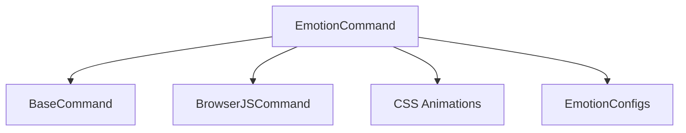

# Emotion Command

## Definition
- **Name**: emotion
- **Description**: Display emotional states and animations in UI
- **Category**: Core
- **Icon**: 😊
- **Status**: 🔴 BROKEN (2025-06-18) - Cannot read properties of undefined (reading 'toLowerCase')
- **Parameters**: `[emotion] [duration] [target]`

## Dependencies

## TODO:
- TODO: Test emotion display functionality
- TODO: Test animation system
- TODO: Test emotion configuration loading