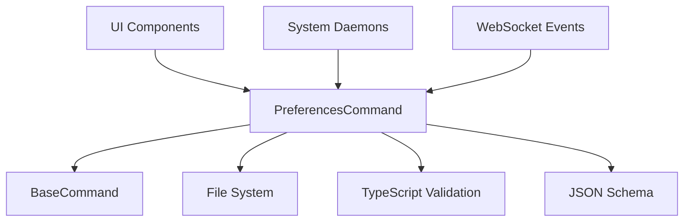

# Preferences Command

## Definition
- **Name**: preferences
- **Description**: Manage user preferences and system configuration with type safety and persistence
- **Category**: Core
- **Icon**: ⚙️
- **Status**: ✅ IMPLEMENTED (2025-06-29) - TypeScript implementation with schema validation
- **Parameters**: `[operation] [data]`

## Philosophy
Preferences are the **nervous system** of the Continuum organism - carrying configuration signals to every component. The preference system provides:

- **Type-safe configuration** with TypeScript interfaces and runtime validation
- **Nested preference paths** using dot notation (e.g., `ui.theme.mode`)
- **Schema-based validation** ensuring data integrity across all components
- **Atomic persistence** to `.continuum/preferences.json` with error recovery
- **Real-time synchronization** between daemons and browser clients

## Dependencies


## Operations
- `get` - Retrieve preference value with fallback to schema defaults
- `set` - Set preference with type validation and persistence
- `list` - List all preferences with optional filtering
- `reset` - Reset specific keys or all preferences to defaults
- `export` - Export all preferences as JSON with metadata
- `import` - Import preferences with merge or replace options

## Schema Structure
```typescript
{
  ui: {
    theme: { mode: 'dark' | 'light', color: string },
    language: string
  },
  system: {
    logging: { level: string, console: boolean },
    autostart: boolean
  }
}
```

## Usage Examples
```bash
# Get a preference
preferences get ui.theme.mode

# Set a preference
preferences set ui.theme.mode dark

# List all UI preferences
preferences list --filter ui

# Reset to defaults
preferences reset ui.theme
```

## Testing Strategy
- **Unit tests**: Type validation, nested access, schema compliance
- **Integration tests**: File persistence, command interface, daemon communication
- **Error recovery**: Corrupted file handling, invalid type recovery
- **Migration tests**: Schema updates and data transformation

## Architectural Notes
- Follows **middle-out architecture** with BaseCommand inheritance
- Uses **TypeScript interfaces** for compile-time and runtime safety
- Implements **atomic file writes** to prevent corruption during updates
- Supports **real-time updates** via WebSocket event propagation
- Designed for **autonomous operation** with comprehensive error handling