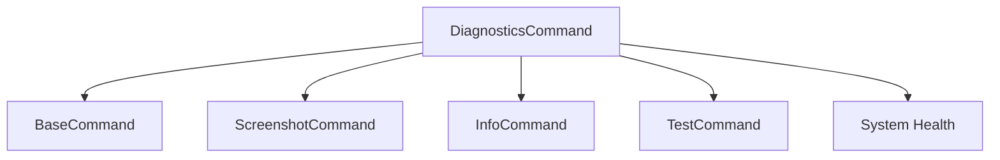

# Diagnostics Command

## Definition
- **Name**: diagnostics
- **Description**: Run comprehensive system diagnostics and health checks
- **Category**: Core
- **Icon**: 🔍
- **Status**: 🔴 BROKEN (2025-06-18) - Diagnostics failed: isolated_test_suite.py missing
- **Parameters**: `[target] [isolation] [verbose]`

## Dependencies


## Parameters
- `target`: Diagnostic target (all, screenshot, network, performance)
- `isolation`: Run in isolated environment (default: true)
- `verbose`: Detailed output (default: false)

## Usage Examples
```bash
# Run full diagnostics
python3 ai-portal.py --cmd diagnostics

# Test screenshot system only
python3 ai-portal.py --cmd diagnostics --params '{"target": "screenshot"}'

# Run with verbose output
python3 ai-portal.py --cmd diagnostics --params '{"verbose": true}'
```

## TODO:
- TODO: Test comprehensive diagnostic suite
- TODO: Test isolated environment execution
- TODO: Test screenshot system diagnostics
- TODO: Test performance monitoring
- TODO: Verify diagnostic report accuracy