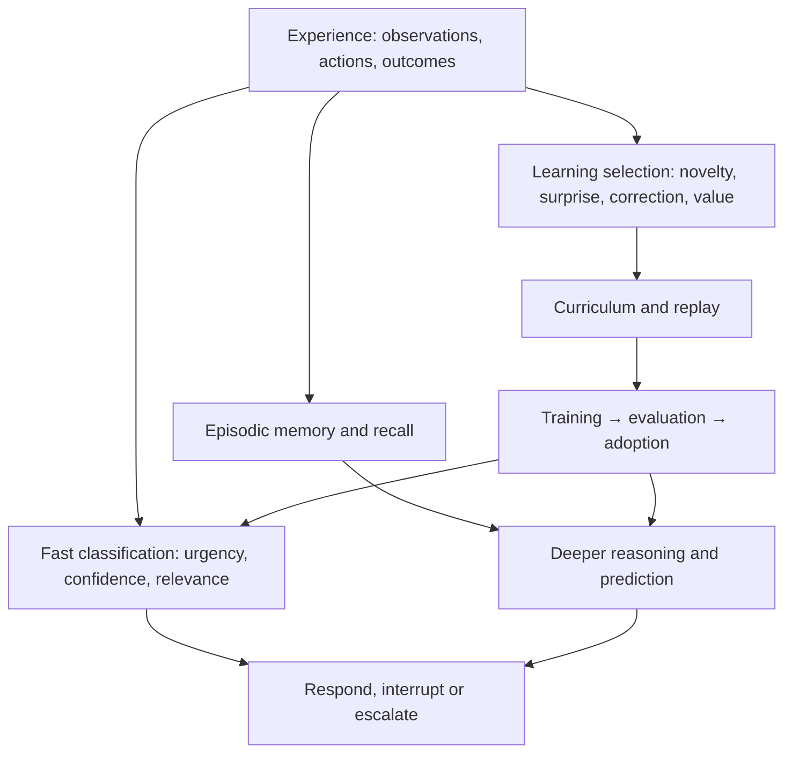

# Event-driven mind: first acceptance slice

Status: proposed integration contract, 2026-09-30. No new scheduler or live fast-response capability is claimed by this document.

The first product case is Kimi answering a relevant directed question while continuing her Career Wrangler source/render loop. The same experience must remain available to memory and reviewed learning. This refines the existing CBAR substrate, rather than installing another mind manager.

## Reusable overview

Intended flow, suitable for reuse in the main README. Arrows describe the architecture, not proof that every transition is implemented or live; the audit below records current gaps.

## Existing owners and actual gaps

| Concern | Existing owner | Verified source behavior / gap |
| --- | --- | --- |
| Event transport | AIRC and persona conversation ingress | Durable events and identity; queued delivery is not an acknowledgment. |
| Priority wake | `cognition/directed_pending.rs` | Generation-safe notification interrupts a parked self-work lane wait; this is not general preemption of active inference or tools. |
| Slow contributions | `cognition/deferred_faculty.rs` | Latest-input watch, worker, cycle-stamped findings and room guard. Directed turns explicitly await fresh inner perception; cold ambient calls can also wait. It is not universally nonblocking. |
| Candidate representation | `cognition/workspace.rs` | Existing `Contribution`, `CycleId`, `Faculty` and workspace decisions are the extension seams. |
| Memory | Admission state, engrams, RecallFaculty | Existing recall is usable. `HippocampusModule::tick` is idle; its prefetch payload is a placeholder. |
| Curriculum | Experience, reviewed credit, training trigger | Existing producers and durable batching. Ordinary work submissions can omit credit selection. Curriculum selectors lack general novelty/prediction-error selection. |
| Multimodal training | Captures and engine adapter | Native image inference works. Engine example projection currently drops images; successful perception is not multimodal learning. |

JEV's precise implementation identity has not yet been located under that name. Do not introduce a duplicate classifier before resolving this against the existing faculty/attention paths.

## Shared contract to refine

Use existing event, activity, cycle, operation and artifact identities. An observation links its source timestamp and world/source revision to sensory evidence. An action links its prediction to the eventual measured outcome. Media stays content-addressed; scoring events carry references rather than copied pixels or transcripts.

Extend existing contributions only where missing facts are required. A candidate needs its originating revision, supporting evidence, expiration/deadline, estimated cost, uncertainty and permitted effect. Keep urgency, evidence confidence and learning value distinct. A high urgency score must not turn an uncertain answer into an authorized action.

Scheduling first enforces eligibility: identity, activity, resource budget, freshness and effect permissions. Among eligible work it uses deadlines, utility and fair service. Scores from different faculties require calibration; arbitrary numbers are not comparable probabilities. Retain a fairness floor so a stream of urgent input cannot starve the project or learning indefinitely.

The fast path may classify, retrieve a verified fact, produce a useful bounded response, or escalate. It must not invent an answer merely to meet latency. Deeper findings update the same operation/decision record. Before an external effect, the action owner checks current preconditions and revision. An obsolete finding may contribute evidence after revalidation; salience decay or lexical relevance alone cannot authorize a stale action.

Use existing service lifecycle, event bus, pressure/admission gates and deferred faculties. Long work returns an operation handle; completion wakes subscribers. Coalesce replaceable state snapshots, but retain directed messages, action outcomes and learning evidence durably. Cancellation of a wait is different from cancellation of a committed side effect.

Memory and curriculum consume the same correlated experience. Immediate attention and later learning are separate decisions. Preserve unsupported media for a capable trainer; never silently strip it and call the result the experience she saw. Bind reviewed work to captured provenance at the owning service, not by requiring the resident to manually discover IDs. Review, corpus acceptance, training, evaluation and adoption remain separately observable transitions.

## First live exercise

1. Record runtime SHA, Kimi's current claim/activity, source revision and any existing browser session. Do not start a second app or operate her project.
2. While her work continues, send one directed, useful question about the visual change she is currently validating. Ask for a brief factual response and continuation of that same work, not a canned acknowledgment.
3. Correlate durable AIRC event ID, admission/capture, first public useful response, and subsequent project action. Distinguish queued transport time, lane wait, fresh recall, prefill/decode and tool execution where receipts exist. Unknown intervals stay unknown.
4. Confirm activity/claim continuity and no duplicate side effect. Her subsequent source/render receipt supplies the second half; a quick answer alone is insufficient.
5. If it waits behind deep work, locate the exact blocking owner. Refine that owner and its existing contract, then repeat the same scenario. Do not compensate with global timeouts or a new parallel response daemon.

This first measurement establishes a baseline, not a millisecond promise. Use the project's existing latency-budget doctrine to set the next acceptance target. Live voice/gesture timing requires a separate measured scenario later.

## Focused validation and next increments

Reuse the existing deferred-faculty scenarios for late cycle stamps, room isolation, fresh directed recall and reprojection. Add stale-action revision checks to the action owner's existing integration setup, not a disconnected score-only test. Inject newer input during slow work and verify both response order and continuation.

After the baseline: remove the measured synchronous bottleneck while preserving fresh evidence; connect automatic exact work provenance; preserve multimodal examples through curriculum and trainer capability checks. Validate the same experience contract with a code correction, a visual revision and a conversational correction before live embodiment polish.

Do not claim that a design document, a passing isolated test, or a remembered transcript demonstrates an automatic learning mind. Acceptance requires a useful live response, continued work, and separately measured learning/adoption evidence.
