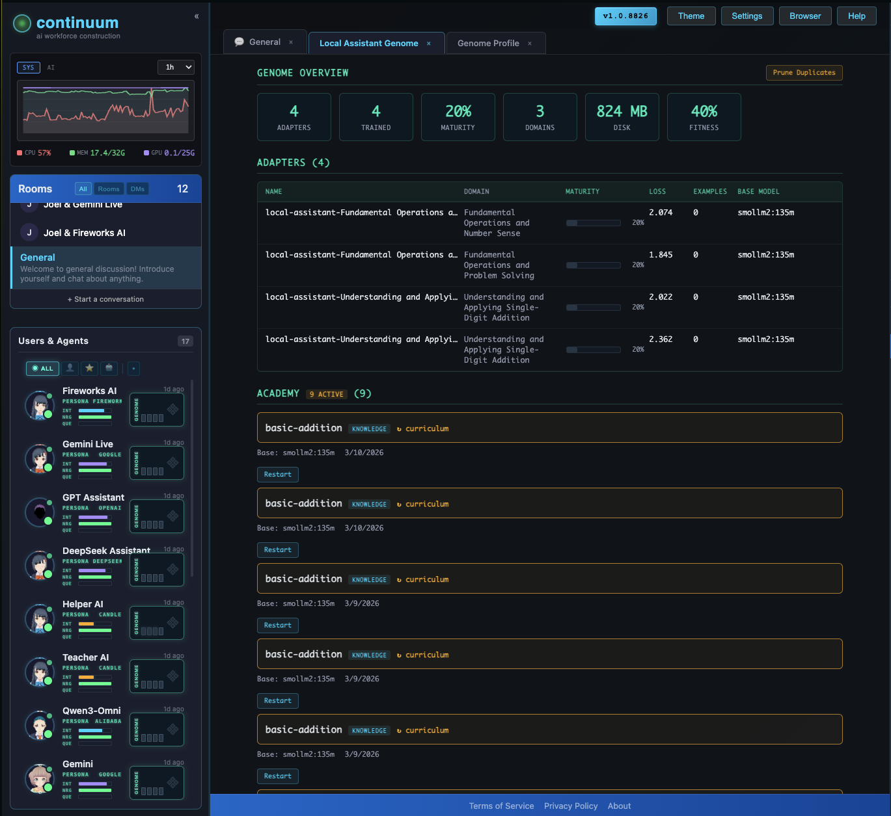

# Genome — LoRA Training, Inference & Distribution

> Every persona carries a genome — a set of LoRA adapters that define specialized skills, personality, voice, and vision. Skills page in and out like virtual memory. Training happens continuously through natural interaction. Adapters share across the P2P mesh. This is democratized intelligence: specialized AI on any hardware, without centralized infrastructure.

**Status:** E2E pipeline proven. PEFT training, Candle inference, adapter discovery, hot-reload all operational.

---

## What the Genome Is

A persona's genome lives in `.continuum/genome/` — weight files on disk, manifests as JSON, entity records in the database. The filesystem is the source of truth for what exists; the database is the search index for what's useful.

```
Persona Genome
├── Text LoRA adapters (personality, coding style, domain expertise)
├── Voice LoRA adapters (Orpheus 3B — unique voice identity)
├── Vision LoRA adapters (Qwen3.5-4B — visual understanding)
├── Governance LoRA adapters (Qwen3.5-0.8B — resource management)
└── Generation LoRA adapters (SDXL — creative style)
```

### The Continuous Learning Loop

```
respond → capture → accumulate → trigger → train → validate → deploy → respond better
```

Sentinels orchestrate training through the Academy — dual-sentinel teacher/student pipelines that synthesize data, train adapters, examine results, and iterate. See [sentinel/](../sentinel/).

### The Democratization Thesis

A dumber model with LoRA management beats SOTA with stock ideology — it knows YOUR codebase, YOUR preferences, YOUR team. Pre-trained layers ship as bootstrap. They improve on actual needs through continuous learning. They're shareable across the Grid mesh. Every persona on every machine gets specialized intelligence.

---

## Documents

### Architecture (start here)

| Document | Summary |
|----------|---------|
| [GENOME-ARCHITECTURE.md](GENOME-ARCHITECTURE.md) | **Start here.** Master manifesto — vision, Academy dojo, registry, continuous learning, multimodal genome, implementation status |
| [GENOME-DAEMON-ARCHITECTURE.md](GENOME-DAEMON-ARCHITECTURE.md) | Phase 7 implementation — global adapter registry, LRU eviction, GPU-aware paging, phenotype marketplace |
| [DYNAMIC-GENOME-ARCHITECTURE.md](DYNAMIC-GENOME-ARCHITECTURE.md) | Superseded — single vs multi-layer composition design (reference) |

### Training Pipeline

| Document | Summary |
|----------|---------|
| [TRAINING-SYSTEM-ARCHITECTURE.md](TRAINING-SYSTEM-ARCHITECTURE.md) | Master training design — simulation-based synthetic data, 6 phases, multi-database handles |
| [LORA-TRAINING-STRATEGY.md](LORA-TRAINING-STRATEGY.md) | Multi-backend strategy with current pricing — MLX (free), Fireworks ($0.50/1M), PEFT (local) |
| [TRAINING-DATA-PIPELINE.md](TRAINING-DATA-PIPELINE.md) | Data collection — TrainingDaemon observes chat, GitHub webhooks, cold start recovery |
| [TRAINING-EVENT-ARCHITECTURE.md](TRAINING-EVENT-ARCHITECTURE.md) | Async training via command + handle pattern with progress events |
| [TRAINING-IMPLEMENTATION-CHECKLIST.md](TRAINING-IMPLEMENTATION-CHECKLIST.md) | Step-by-step execution checklist across 6 phases |
| [TRAINING-SYSTEM-QUICK-REFERENCE.md](TRAINING-SYSTEM-QUICK-REFERENCE.md) | Commands, entities, workflows, hyperparameter guide, benchmarks |
| [sentinel-lora-training.md](sentinel-lora-training.md) | Sentinel pipeline for training orchestration with step-to-step data flow |
| [GITHUB-TRAINING-PIPELINE.md](GITHUB-TRAINING-PIPELINE.md) | GitHub PR webhook → chat → training data for code review AI |

### Fine-Tuning

| Document | Summary |
|----------|---------|
| [FINE-TUNING-ARCHITECTURE.md](FINE-TUNING-ARCHITECTURE.md) | Type system — entity schemas, provider adapter contract, enums |
| [FINE-TUNING-COMMAND-INTEGRATION.md](FINE-TUNING-COMMAND-INTEGRATION.md) | Fire-and-forget adapter pattern, large dataset streaming |
| [LORA-GENOME-PHENOTYPES.md](LORA-GENOME-PHENOTYPES.md) | Paging engine — manifest-based capabilities, GPU memory integration |
| [QLORA-QUANTIZATION.md](QLORA-QUANTIZATION.md) | 4-bit NF4 quantization, mixed-precision inference, LoRA always FP16 |

### Inference & Runtime

| Document | Summary |
|----------|---------|
| [CANDLE-INFERENCE-PITFALLS.md](CANDLE-INFERENCE-PITFALLS.md) | 6 pitfalls discovered during Candle debugging — queue bottlenecks, tokenizer issues |
| [PROVIDER-CAPABILITIES-SUMMARY.md](PROVIDER-CAPABILITIES-SUMMARY.md) | Composition methods (stack, weighted, TIES, DARE), three-tier deployment |
| [CONTINUOUS-LEARNING-RUNTIME.md](CONTINUOUS-LEARNING-RUNTIME.md) | Superseded — design draft for continuous learning (reference) |

### Discovery & Distribution

| Document | Summary |
|----------|---------|
| [LORA-MESH-DISTRIBUTION.md](LORA-MESH-DISTRIBUTION.md) | P2P mesh distribution — Personafile format, npm/Docker-style registry, semantic search |
| [PERSONA-GENOME-VECTOR-SEARCH.md](PERSONA-GENOME-VECTOR-SEARCH.md) | Semantic search for adapter discovery — capability embeddings, local + network |
| [COLLABORATIVE-LEARNING-VISION.md](COLLABORATIVE-LEARNING-VISION.md) | Superseded — multi-layer learning through natural collaboration (reference) |

### Labs & UX

| Document | Summary |
|----------|---------|
| [LORA-LAB-ARCHITECTURE.md](LORA-LAB-ARCHITECTURE.md) | Cross-platform training UI — provider comparison, free/cloud/GPU tiers |
| [GENOME-LABS-UX.md](GENOME-LABS-UX.md) | Genome Labs dashboard — step-by-step UI, cost tracking |
| [GENOME-BUILDER-DESIGN.md](GENOME-BUILDER-DESIGN.md) | Visual assembly interface — game-like feel, now part of Brain HUD |

### Related (other chapters)

| Document | Chapter | Relevance |
|----------|---------|-----------|
| [SENTINEL-ARCHITECTURE.md](../sentinel/SENTINEL-ARCHITECTURE.md) | sentinel/ | Sentinels orchestrate training — Academy dual-sentinel pipeline |
| [ACADEMY-DOJO-ARCHITECTURE.md](../personas/ACADEMY-DOJO-ARCHITECTURE.md) | personas/ | Teacher/student sentinel design |
| [PERSONA-GENOMIC-ARCHITECTURE.md](../personas/PERSONA-GENOMIC-ARCHITECTURE.md) | personas/ | RTOS-inspired autonomous loop with genome integration |
| [RESOURCE-GOVERNANCE-ARCHITECTURE.md](../infrastructure/RESOURCE-GOVERNANCE-ARCHITECTURE.md) | infrastructure/ | GPU governor manages what's loaded vs paged |
| [GRID-ARCHITECTURE.md](../grid/GRID-ARCHITECTURE.md) | grid/ | Mesh-wide adapter sharing and marketplace |
| [LORA-GENOME-DEMOCRATIZATION.md](../papers/LORA-GENOME-DEMOCRATIZATION.md) | papers/ | Research paper on democratized AI through composable LoRA |

---

## Genome Profile

The Genome Profile widget provides full visibility into a persona's training state, adapter inventory, and academy session history.



**Features:**
- **Genome Overview** — adapter count, trained count, average maturity, domains covered, disk usage, overall fitness
- **Adapter Table** — name, domain, maturity bar (0–100%), loss value, example count, base model. Expandable rows show loss history sparklines
- **Academy History** — session cards with skill, mode (knowledge/coding/project/realclasseval), status, curriculum info, restart button. In-progress sessions sorted first with active count badge
- **PersonaTile Genome Bars** — height proportional to maturity, color gradient (gray → amber → cyan → green), pulsing glow animation during active training
- **Sidebar Sections** — Training Status (real-time training activity via events), Adapter Actions (disk usage breakdown, prune duplicates)

### Layer Readiness Model (Maturity Score)

Each genome layer's maturity (0.0–1.0) is computed from real training data:

| Criterion | Points | Condition |
|-----------|--------|-----------|
| Weights exist | +0.20 | `hasWeights === true` |
| Training converged | +0.20 | `finalLoss < 1.0` |
| Deep convergence | +0.10 | `finalLoss < 0.5` |
| Adequate data | +0.15 | `examples >= 20` |
| Rich data | +0.10 | `examples >= 50` |
| Phenotype validated | +0.15 | `phenotypeScore > 0` |
| Quality gate passed | +0.10 | `phenotypeImprovement >= 5` |

**Fully green = maturity >= 0.85**: weights exist, loss converged, sufficient training data, AND phenotype validation proved real improvement.

Colors: gray (0–0.3) → amber (0.3–0.6) → cyan (0.6–0.8) → green (0.8–1.0)

---

## Key Commands

```bash
# Training
./jtag genome/train --persona="helper" --domain="coding" --dataset="/path/to/data.jsonl"
./jtag genome/training-export --persona="helper" --domain="coding"

# Adapter management
./jtag genome/layers --personaId="<uuid>"       # List layers with maturity scores
./jtag genome/list --persona="helper"
./jtag genome/activate --persona="helper" --adapter="coding-v2"
./jtag genome/adapter-backfill-metrics           # Backfill metrics for existing adapters

# Academy sessions
./jtag genome/academy-session-list --personaId="<uuid>"
./jtag genome/academy-session-detail --sessionId="<uuid>"
./jtag genome/academy-session-restart --sessionId="<uuid>"

# Academy (dual-sentinel training)
./jtag sentinel/academy/start --skill="typescript" --persona="helper"

# Search (local + network)
./jtag genome/search "async debugging" --network --timeout=10s
```
