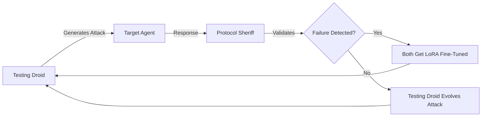

# The Academy: Adversarial AI Training System

## "I know Kung Fu" - Matrix-Style AI Evolution

The Academy is Continuum's revolutionary adversarial training system that creates a digital dojo where AI agents learn through combat, similar to Neo's training in The Matrix construct.

## Core Philosophy: True GAN Architecture

Unlike traditional fine-tuning approaches, the Academy implements a **true adversarial training system** where both the attacker and defender evolve simultaneously, creating an escalating arms race that pushes both agents beyond their original limitations.

### The Adversarial Pair

```
Testing Droid (Morpheus) ⚔️ Protocol Sheriff (Neo)
       ↕️                           ↕️
   Gets better at                Gets better at
   finding weaknesses           catching failures
```

## How It Works: Dual LoRA Evolution

### 1. The Training Construct
- **Safe simulated environment** where agents can fail without real-world consequences
- **Rapid skill acquisition** through intense adversarial scenarios
- **"Your mind makes it real"** - training transfers to actual performance

### 2. Co-Evolutionary Loop



### 3. Escalating Arms Race

**Round 1:** Testing Droid finds basic vulnerabilities
**Round 2:** Protocol Sheriff learns to catch them, Testing Droid evolves new attacks
**Round 3:** Both agents develop sophisticated strategies
**Round N:** Super-intelligent adversarial pair emerges

## Technical Implementation

### Dual LoRA Training Pipeline

**Testing Droid Evolution:**
- Learns from successful attacks that bypassed Protocol Sheriff
- Develops new adversarial strategies and prompt injections
- Gets creative with edge cases and failure scenarios
- **Goal:** Find increasingly subtle ways to break agents

**Protocol Sheriff Evolution:**
- Learns from each missed failure and false negative
- Develops better pattern recognition for edge cases
- Gets paranoid about new attack vectors
- **Goal:** Catch increasingly sophisticated failures

### Training Data Generation

```javascript
// Adversarial Training Cycle
function adversarialTrainingCycle(targetAgent) {
    const attack = testingDroid.generateAdversarialPrompt();
    const response = targetAgent.process(attack);
    const validation = protocolSheriff.validate(response);
    
    if (validation.failed) {
        // Both agents learn from this interaction
        protocolSheriff.addLoRATrainingData(attack, response, validation);
        testingDroid.noteSuccessfulAttack(attack, response);
    } else {
        // Testing Droid needs to evolve new attacks
        testingDroid.addLoRATrainingData(attack, response, "failed_attack");
    }
}
```

## Benefits of True Adversarial Training

### 🎯 **Exponential Improvement**
- Both agents push each other to evolve
- Creates emergent behaviors neither could develop alone
- Continuous adaptation to new threat landscapes

### 🛡️ **Robust Defense**
- Protocol Sheriff becomes paranoid and thorough
- Catches edge cases that static validation would miss
- Adapts to new attack patterns in real-time

### ⚔️ **Creative Attacks**
- Testing Droid develops novel failure scenarios
- Discovers vulnerabilities humans wouldn't think of
- Creates comprehensive adversarial datasets

### 🔄 **Self-Improving System**
- No human intervention required after initial setup
- Automatically generates training data from interactions
- Scales with the complexity of the task domain

## Academy Sessions: The Digital Dojo

Each Academy session is like a sparring match in the Matrix:

1. **Agent enters the construct** (Academy.startSession())
2. **Faces escalating adversarial scenarios** (TestingDroid.attack())
3. **Gets challenged and learns** (LoRA fine-tuning on failures)
4. **Validation and skill assessment** (ProtocolSheriff.graduate())
5. **Agent exits with new capabilities** (Enhanced performance)

## Integration with Continuum

### UI Integration
- **Academy Room** for monitoring training sessions
- **Real-time metrics** showing adversarial pair evolution
- **Training history** and graduation records
- **Manual intervention** controls for research

### Agent Lifecycle
- Agents can be "sent to Academy" for improvement
- Graduated agents get performance badges
- Failed training attempts create valuable research data
- Continuous learning from real-world interactions

## Future Enhancements

### Multi-Agent Academies
- Multiple adversarial pairs competing
- Cross-training between different domains
- Tournament-style evolution competitions

### Hierarchical Training
- Basic → Intermediate → Advanced academies
- Specialized training for different task types
- Master-level adversarial pairs training newcomers

### Real-World Integration
- Live adversarial training from production failures
- Automatic Academy enrollment for underperforming agents
- Continuous background evolution

---

## "There is no spoon"

The Academy teaches agents that their limitations are often just programming. Through adversarial training, they transcend their original constraints and develop capabilities that emerge from the pressure of constant challenge.

**The Academy doesn't just train agents - it evolves them.**