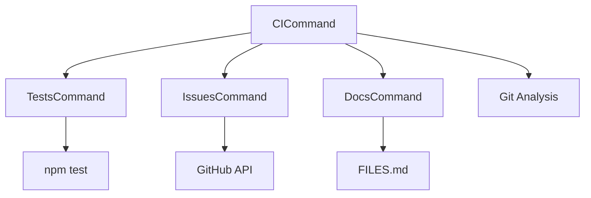

# CI Command

## Definition
- **Name**: ci
- **Description**: GitHub Actions integration with automated issue tracking
- **Category**: Development
- **Icon**: 🚀
- **Status**: 🟢 ACTIVE (Modular CI/CD ready)

## Overview
The CI command provides elegant GitHub Actions integration that calls modular Continuum commands rather than duplicating logic. Handles automated testing, issue tracking, and status updates through the established command ecosystem.

## Key Innovation
**YAML Stays Simple** - GitHub Actions workflows call single Continuum commands that handle all logic modularly.

## Parameters
- `action`: CI action (full_check, run_tests, update_issues, analyze_commit)
- `commit_sha`: Git commit SHA for analysis
- `pr_number`: Pull request number for context
- `github_token`: GitHub API token for issue operations
- `test_results`: Path to test results JSON for issue updates

## Usage Examples
```bash
# Full CI check (called from GitHub Actions)
python3 ai-portal.py --cmd ci --params '{"action": "full_check", "commit_sha": "abc123", "github_token": "token"}'

# Analyze specific commit for issue references
python3 ai-portal.py --cmd ci --params '{"action": "analyze_commit", "commit_sha": "abc123"}'

# Update issues based on test results
python3 ai-portal.py --cmd ci --params '{"action": "update_issues", "test_results": "/tmp/ci_results.json"}'

# Run tests in CI mode
python3 ai-portal.py --cmd ci --params '{"action": "run_tests"}'
```

## GitHub Actions Integration
```yaml
# Simple YAML - complex logic in Continuum commands
- name: Continuum CI Check
  run: |
    python python-client/ai-portal.py --cmd ci --params '{
      "action": "full_check",
      "commit_sha": "'$COMMIT_SHA'",
      "github_token": "'$GITHUB_TOKEN'"
    }'
```

## Automated Issue Flow
### Test Failures → Issues
- CI detects test failures
- Auto-creates GitHub issues with `ci-failure` label
- Assigns to last committer
- Links to failing commit

### Issue Resolution → Auto-Close
- Tests pass after fixes
- Auto-closes related issues
- Comments with commit reference
- Updates dashboard status

### Commit Analysis → Issue Updates
- Parses commit messages for issue references
- `fixes #123` → closes issue #123
- `ref #456` → adds comment to issue #456
- Updates issue status automatically

## Modular Command Integration
The CI command calls existing Continuum commands:
- **`tests`** - Run comprehensive test suite
- **`issues`** - Create/update/close issues
- **`docs`** - Update FILES.md and documentation
- **`screenshot`** - Capture verification images

## Configuration Files
- `config/ci_flows.json` - Issue transition rules and automation
- `workflows/test-and-issues.yml` - GitHub Actions template

## Dependencies


## Benefits
- **Simple YAML** - No complex GitHub Actions logic
- **Reusable Logic** - Commands work in CI and locally
- **Consistent Interface** - Same patterns as other commands
- **Self-Contained** - All logic in modular commands
- **Testable** - Each command has its own tests

## Package Rules
```json
{
  "timeouts": {"ci_check": 300.0, "test_run": 600.0},
  "retries": {"github_api": 3, "git_ops": 2},
  "resources": {
    "external": ["github_api", "git", "npm"],
    "internal": ["file_system", "command_registry"]
  },
  "concurrency": {"safe": true, "parallel_tests": false},
  "sideEffects": ["creates_issues", "closes_issues", "updates_files", "runs_tests"]
}
```