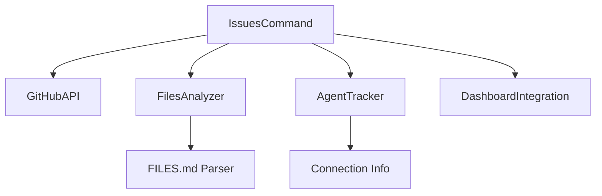

# Issues Command

## Definition
- **Name**: issues
- **Description**: AI-driven GitHub issue management with multi-agent collaboration
- **Category**: Development
- **Icon**: 🎯
- **Status**: 🟢 ACTIVE (AI collaboration ready)

## Overview
The Issues command provides AI-driven project management integrated with GitHub Issues. Syncs with FILES.md ticket system, enables multi-agent collaboration, and automates issue creation from test failures and code analysis.

## Parameters
- `action`: Action to perform (list, create, update, assign, sync, dashboard)
- `filter`: Filter issues (open, closed, assigned, ai-created, test-failures)
- `agent`: Agent name for assignment/filtering (uses connection agent by default)
- `priority`: Priority level (critical, high, medium, low)
- `category`: Issue category (cleanup, investigation, test-failure, architecture, enhancement)
- `auto_create`: Auto-create issues from FILES.md comments (default: false)

## Usage Examples
```bash
# View dashboard of current issues
python3 ai-portal.py --cmd issues --params '{"action": "dashboard"}'

# List issues assigned to current agent
python3 ai-portal.py --cmd issues --params '{"action": "list", "filter": "assigned"}'

# Create issue from FILES.md detection
python3 ai-portal.py --cmd issues --params '{"action": "create", "category": "test-failure", "title": "Screenshot tests failing", "agent": "Claude"}'

# Sync FILES.md with GitHub issues
python3 ai-portal.py --cmd issues --params '{"action": "sync", "auto_create": true}'

# Assign yourself to an issue
python3 ai-portal.py --cmd issues --params '{"action": "assign", "issue_id": "123", "agent": "auto"}'

# Update issue status
python3 ai-portal.py --cmd issues --params '{"action": "update", "issue_id": "123", "status": "in_progress"}'
```

## AI Collaboration Features
- **Agent assignment** - Issues can be assigned to specific AI agents
- **Status tracking** - in_progress, testing, review, completed
- **Auto-creation** - Creates issues from test failures and FILES.md markers
- **Dashboard integration** - Issues appear in ai-agent.py dashboard
- **Cross-reference** - Links with FILES.md ticket system

## Issue Categories (matching FILES.md system)
- 🧹 **cleanup** - Dead code, clutter, organization issues
- 🌀 **investigation** - Suspicious code that needs review  
- 🔥 **test-failure** - Broken tests that need fixing
- 📦 **architecture** - Refactoring or structural improvements
- 🎯 **enhancement** - New features or improvements

## Git Integration
- **Pre-commit hooks** - Auto-create issues from test failures
- **Commit messages** - Reference and auto-close issues
- **Status sync** - Updates based on commit activity

## Dependencies


## Configuration
- Uses external config files (no hardcoded messages)
- GitHub API token from environment/config
- Agent identification from connection properties
- Issue templates in separate files

## Package Rules
```json
{
  "timeouts": {"github_api": 30.0, "file_analysis": 10.0},
  "retries": {"github_api": 3, "file_ops": 2},
  "resources": {
    "external": ["github_api", "git_info"],
    "internal": ["file_system", "agent_connection", "dashboard"]
  },
  "concurrency": {"safe": true, "multi_agent": true},
  "sideEffects": ["creates_github_issues", "modifies_files_md", "updates_dashboard"]
}
```