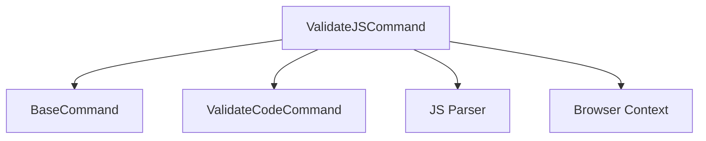

# Validate JS Command

## Definition
- **Name**: validate_js
- **Description**: Validate JavaScript code and syntax
- **Category**: Core
- **Icon**: 🔧
- **Status**: 🟠 UNTESTED (2025-06-18) - Needs documentation and testing
- **Parameters**: `[script] [strict] [browser]`

## Dependencies

## TODO:
- TODO: Test JavaScript validation
- TODO: Test browser compatibility checks
- TODO: Test syntax error reporting