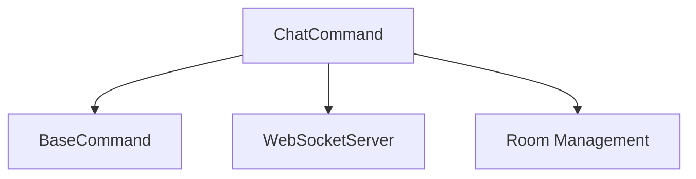

# Chat Command

## Definition
- **Name**: chat
- **Description**: Handle chat messaging and room communication
- **Category**: Core
- **Icon**: 💬
- **Status**: 🔴 BROKEN (2025-06-18) - Cannot read properties of undefined (reading 'chatRooms')
- **Parameters**: `[message] [room] [target]`

## Dependencies


## Parameters
- `message`: Message content to send
- `room`: Target room for message
- `target`: Specific user target (optional)

## Usage Examples
```bash
# Send message to default room
python3 ai-portal.py --cmd chat --params '{"message": "Hello everyone"}'

# Send to specific room
python3 ai-portal.py --cmd chat --params '{"message": "Hello", "room": "general"}'
```

## TODO:
- TODO: Test message sending functionality
- TODO: Test room targeting
- TODO: Test message validation