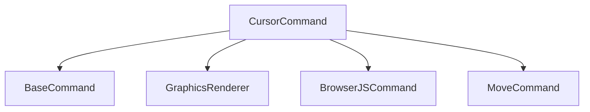

# Cursor Command

## Definition
- **Name**: cursor
- **Description**: Handle cursor positioning and graphics rendering
- **Category**: Core
- **Icon**: 🎯
- **Status**: 🔴 BROKEN (2025-06-18) - BaseCommand error: "execute must be implemented by subclass"
- **Parameters**: `[x] [y] [action] [duration]`

## Overview
The Cursor command manages cursor positioning, graphics rendering, and visual feedback for user interactions.

## Dependencies

## Learning Notes (for next AI agent)
**🔍 Investigation Results (2025-06-18)**:
- Command exists but inherits from BaseCommand without implementing execute()
- Server response: `"execute must be implemented by subclass"`
- **Root Cause**: Missing execute method in CursorCommand.cjs
- **Next Steps**: Implement execute method or identify correct base class
- **Related Issues**: Same pattern seen in `info`, `input`, `type` commands

**💡 Quick Fix**: Add execute method to CursorCommand.cjs or find correct parent class

## TODO:
- TODO: Implement cursor positioning logic
- TODO: Add graphics rendering integration
- TODO: Test browser interaction feedback
- TODO: Write comprehensive unit tests
- TODO: Document cursor animation system