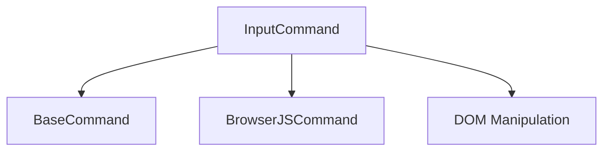

# Input Command

## Definition
- **Name**: input
- **Description**: Handle user input and form interactions
- **Category**: Core
- **Icon**: ⌨️
- **Status**: 🔴 BROKEN (2025-06-18) - execute must be implemented by subclass
- **Parameters**: `[text] [selector] [method]`

## Dependencies

## TODO:
- TODO: Test text input functionality
- TODO: Test form interactions
- TODO: Test element selection