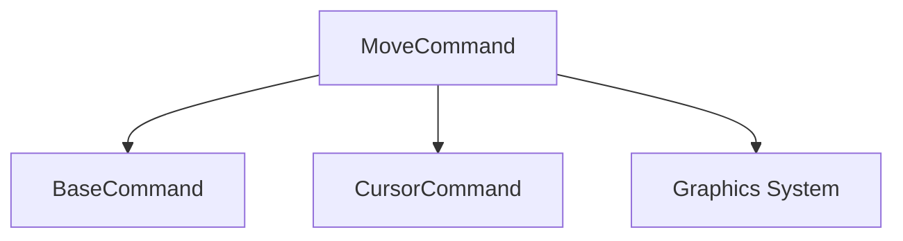

# Move Command

## Definition
- **Name**: move
- **Description**: Handle cursor and element movement operations
- **Category**: Core
- **Icon**: 🔄
- **Status**: 🟠 UNTESTED (2025-06-18) - Needs documentation and testing
- **Parameters**: `[x] [y] [target] [duration]`

## Dependencies

## TODO:
- TODO: Test cursor movement
- TODO: Test animated movement
- TODO: Test target element movement