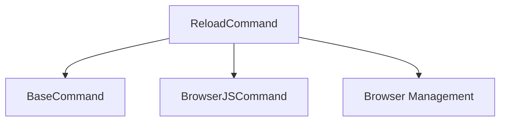

# Reload Command

## Definition
- **Name**: reload
- **Description**: Reload browser page or refresh system components
- **Category**: Core
- **Icon**: 🔄
- **Status**: 🔴 BROKEN (2025-06-18) - Server base64 encoding validation error: "Only base64 encoding is supported"
- **Parameters**: `[target] [force]`

## Dependencies

## TODO:
- TODO: Test browser page reload
- TODO: Test system component refresh
- TODO: Test force reload functionality