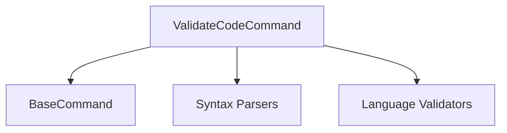

# Validate Code Command

## Definition
- **Name**: validate_code
- **Description**: Validate code syntax and structure
- **Category**: Core
- **Icon**: ✅
- **Status**: 🟠 UNTESTED (2025-06-18) - Needs documentation and testing
- **Parameters**: `[code] [language] [strict]`

## Dependencies

## TODO:
- TODO: Test code validation functionality
- TODO: Test multi-language support
- TODO: Test strict validation mode