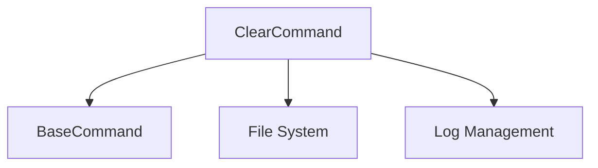

# Clear Command

## Definition
- **Name**: clear
- **Description**: Clear console, logs, or system state
- **Category**: Core
- **Icon**: 🧹
- **Status**: 🟢 STABLE (2025-06-18) - Command executing successfully, cleanup completed
- **Parameters**: `[target] [confirm]`

## Dependencies


## Parameters
- `target`: What to clear (console, logs, cache, all)
- `confirm`: Confirmation flag for destructive operations

## Usage Examples
```bash
# Clear console
python3 ai-portal.py --cmd clear --params '{"target": "console"}'

# Clear logs with confirmation
python3 ai-portal.py --cmd clear --params '{"target": "logs", "confirm": true}'
```

## TODO:
- TODO: Test console clearing
- TODO: Test log clearing functionality
- TODO: Test confirmation system for destructive operations