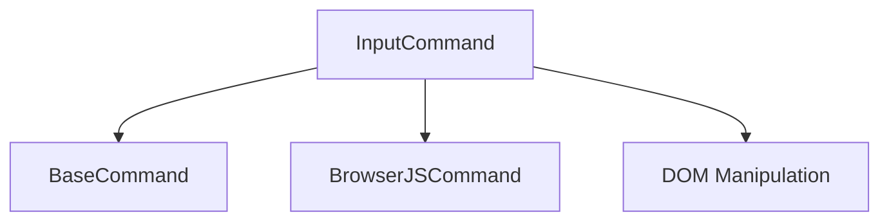

# Input Command

## Definition
- **Name**: input
- **Description**: Handle user input and form interactions
- **Category**: Core
- **Icon**: ⌨️
- **Status**: 🔴 BROKEN (2025-06-18) - Method signature mismatch: has instance execute() but needs static execute()
- **Parameters**: `[text] [selector] [method]`

## Dependencies

## Learning Notes (for next AI agent)
**🔍 Investigation Results (2025-06-18)**:
- Command has comprehensive execute method (380+ lines of code!)
- BUT it's an instance method: `async execute(params, context)` (line 80)
- BaseCommand expects STATIC method: `static async execute(params, continuum)` (line 12)
- **Root Cause**: Method signature mismatch, not missing implementation
- **Quick Fix**: Change line 80 from `async execute(params, context)` to `static async execute(params, continuum)`
- **Note**: This is a sophisticated input handling system with mouse, keyboard, touch, and drag support
- **Related Issues**: Other commands probably have same static/instance method issue

**💡 Ready for immediate fix** - this is a well-implemented command just needs method signature update!

**🛡️ Sentinel Debugging (2025-06-18)**:
- Created sentinel task: `debug-input-command`
- Logs location: `.continuum/sentinel/debug-input-command/`
- Confirmed error reproduction under sentinel monitoring
- No additional server-side issues found - pure method signature problem

## TODO:
- TODO: Test text input functionality
- TODO: Test form interactions
- TODO: Test element selection