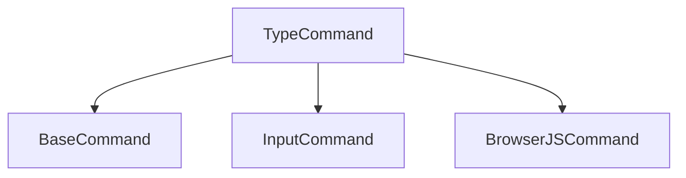

# Type Command

## Definition
- **Name**: type
- **Description**: Type text into active elements or fields
- **Category**: Core
- **Icon**: ⌨️
- **Status**: 🔴 BROKEN (2025-06-18) - BaseCommand error: "execute must be implemented by subclass"
- **Parameters**: `[text] [selector] [speed]`

## Dependencies

## TODO:
- TODO: Test text typing functionality
- TODO: Test typing speed control
- TODO: Test element targeting