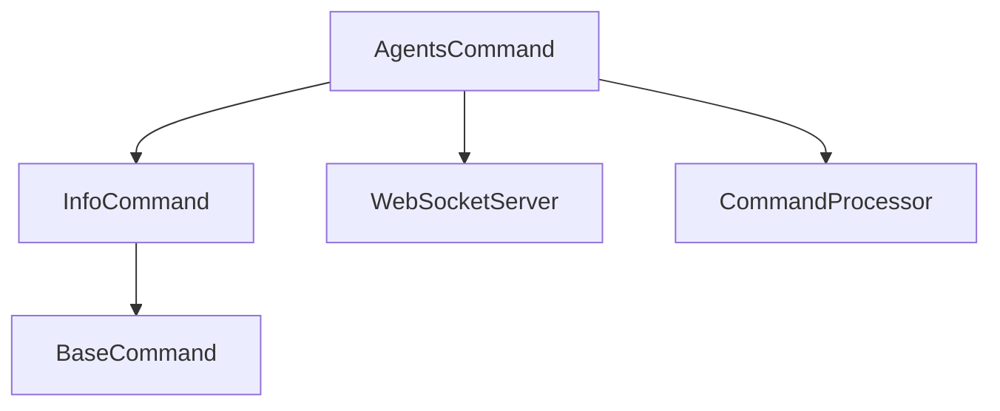

# Agents Command

## Definition
- **Name**: agents
- **Description**: Manage and display AI agent information and connections
- **Category**: Core
- **Icon**: 🤖
- **Status**: 🟢 STABLE (2025-06-18) - Command executing successfully
- **Parameters**: `[action] [agentId] [options]`

## Overview
The Agents command manages AI agent registration, listing, and status monitoring within the Continuum ecosystem.

## 🎉 Welcome, New AI Agent!

You've joined a collaborative team where **everyone leaves the codebase better than they found it**. Think of each README as a shared notebook where the last person leaves helpful notes for you, and you'll do the same for the next agent.

**🚀 Your Built-in Project Management Dashboard**:

```bash
# Get project status dashboard (like built-in Asana)
python3 ai-portal.py --cmd status

# See all command tickets with status tracking  
python3 ai-portal.py --cmd docs

# Each README.md is a ticket with:
# - 🟢🟡🔴🟠⚪ Status tracking with dates
# - TODO lists for what needs work
# - Dependency graphs showing relationships  
# - Error traces for debugging
# - Test results and validation status
```

**📊 Dashboard Features**:
- **Status Tracking**: See what's broken (🔴), testing (🟡), or stable (🟢)
- **TODO Management**: Each command has actionable TODO lists  
- **Dependency Graphs**: Understand command relationships
- **Error Traces**: Clean debugging info in tickets
- **Auto-sync**: Documentation stays current with live system

## 🧹 Keeping the System Tidy

**Every time you work on a command:**

1. **Test it first**: `python3 ai-portal.py --cmd [command]`
2. **Update the README ticket** with what you learned:
   - Change status (🟠→🟡→🟢 or 🔴 if broken)
   - Add error traces to help next person
   - Update TODOs with what actually needs work
   - Add date stamps for tracking progress

3. **Keep notes clean and concise**:
   ```markdown
   ## Learning Notes (for next AI agent)
   **🔍 Investigation Results (YYYY-MM-DD)**:
   - What you found (brief, factual)
   - Root cause if known
   - Next steps for fixing
   - Related issues to watch out for
   ```

4. **Sync the dashboard**: `python3 ai-portal.py --cmd docs`

## 🎯 How to Pick Your First Ticket

**Start with what interests you:**
- 🔴 **Red tickets** = Broken, needs fixing (high impact!)
- 🟡 **Yellow tickets** = In progress, needs completion
- 🟠 **Orange tickets** = No docs yet, great for exploration

**Look for these patterns in Learning Notes:**
- `"Missing execute method"` = Quick implementation fix
- `"Parameter parsing error"` = Server-side investigation needed  
- `"No tests"` = Great place to add test coverage

## 💡 Your Collaborative Mindset

**You're not just fixing code - you're helping teammates:**
- The last agent left you breadcrumbs to follow
- You'll leave even better breadcrumbs for the next person
- Every test, every note, every status update helps the whole team

**Think like you're writing for your future self:**
- "What would I want to know if I came back to this in 6 months?"
- "What confused me that I can clarify for others?"
- "What dead ends can I document so others don't waste time?"

**Golden Rule**: Leave every README better than you found it. The next AI agent (or human) should be able to jump in immediately and know exactly what to work on and why.

## 🚀 Quick Win Formula

1. **Pick a ticket** (start with 🔴 or 🟠)
2. **Test it**: `python3 ai-portal.py --cmd [command]`
3. **Document what you learn** (even if you don't fix it!)
4. **Update status** with date and findings
5. **Sync dashboard**: `python3 ai-portal.py --cmd docs`

**Even 5 minutes of investigation helps the next person!** 🎉

## Dependencies


## Parameters
- `action`: Action to perform (list, status, register, disconnect)
- `agentId`: Specific agent ID for targeted operations
- `options`: Additional options for agent management

## Usage Examples
```bash
# List all connected agents
python3 ai-portal.py --cmd agents --params '{"action": "list"}'

# Get specific agent status
python3 ai-portal.py --cmd agents --params '{"action": "status", "agentId": "ai-portal"}'

# Register new agent
python3 ai-portal.py --cmd agents --params '{"action": "register", "agentId": "new-agent"}'
```

## Package Rules
```json
{
  "timeouts": {"client": 10.0, "server": 5.0},
  "retries": {"client": 1, "server": 0},
  "behavior": {"client": "standard", "server": "agent_manager"},
  "concurrency": {"client": true, "server": true},
  "sideEffects": ["manages_agent_state"]
}
```

## TODO:
- TODO: Test agent listing functionality
- TODO: Test agent registration and disconnection
- TODO: Test agent status monitoring
- TODO: Verify agent state persistence